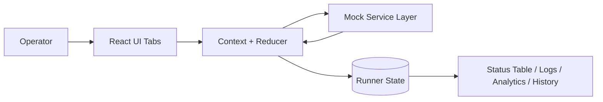
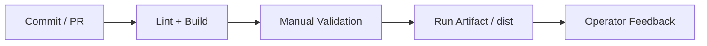
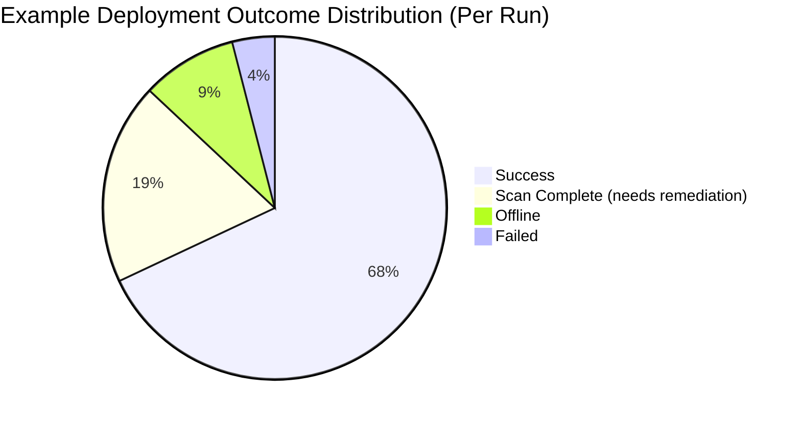
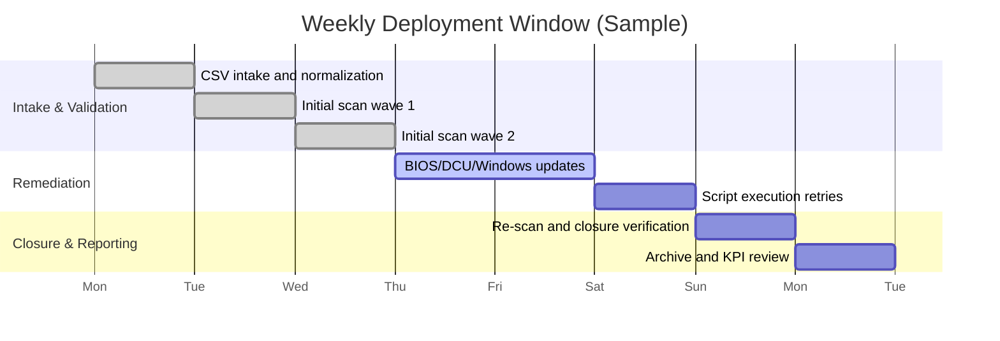

# Secure Deployment Runner

> **Status key:** 🟢 Done · 🟠 In Progress · 🔵 Planned · 🔄 Recovery/Rebuild · 📝 Documentation Pending

## 🎯 Overview
Secure Deployment Runner is a React + TypeScript operations dashboard for coordinating endpoint imaging handoff, compliance validation, and remote remediation workflows at scale. It is designed for IT teams that need a centralized interface to track device readiness, run deployment actions in bulk, and preserve an auditable history of each deployment run. The current implementation uses a simulated PowerShell-style service layer to model real-world behavior (connectivity failures, retries, compliance outcomes, update/reboot lifecycle, and script execution), making it useful for workflow validation, UI prototyping, and operator training before integrating with live infrastructure. Primary stakeholders are imaging technicians, deployment operators, shift leads, and platform engineers preparing production integration. Success looks like faster remediation loops, safer bulk execution, and complete run evidence for operations and leadership review.

### Outcomes
- Maintain a reliable imaging-to-deployment handoff with minimal manual re-entry.
- Improve operator decision speed with live statuses, compliance drill-downs, and logs.
- Reduce high-impact mistakes through credential prompts, confirmation gates, and disabled invalid actions.
- Preserve run-level auditability with history archives and analytics views.
- Keep contracts close to production orchestration patterns so backend integration requires minimal refactor.

## 📌 Scope & Status

| Area | Status | Notes | Next Milestone |
|---|---|---|---|
| Core deployment actions | 🟠 In Progress | Validate/update/script/reboot/cancel/remove workflows run via mock service layer. | Remove duplicate reducer action cases and unify transitions. |
| Imaging intake + transfer | 🟢 Done | Image Monitor transfer (selected/all), rename/remove, and filtering are available. | Add regression tests around transfer edge cases. |
| CSV onboarding | 🟢 Done | Hostname/MAC normalization with explicit row-level error handling is present. | Add malformed-header and parser-fixture tests. |
| Quality gates | 🟠 In Progress | Build passes; lint currently fails due to pre-existing unused-variable issues. | Reach clean lint baseline and add automated tests. |
| CI/CD + observability automation | 🔵 Planned | No committed GitHub workflow yet. | Add CI for lint/build and artifact publishing. |
| Production API/auth integration | 🔵 Planned | Runtime behavior is intentionally simulated. | Introduce API adapter + environment-driven service selection. |

> **Scope note:** Current scope focuses on local/operator workflow rehearsal and simulation. Deferred items include production endpoint orchestration, immutable backend audit logs, RBAC/SSO hardening, and vault-backed secrets brokering.

## 🏗️ Architecture
Secure Deployment Runner is a frontend-first architecture with React components for operator workflows, a centralized reducer in `AppContext` for state/control orchestration, and a simulated deployment service boundary that mirrors future backend interfaces. Device records enter via Image Monitor transfers or CSV import, then flow through action-driven lifecycle transitions that drive table statuses, logs, and run history outputs.



| Component | Responsibility | Key Interfaces |
|---|---|---|
| `App.tsx` + `components/` | Multi-tab operational UI (Image Monitor, Deployment Runner, Imaging Script, Build Output) | Tab navigation, modal actions, status tables/cards |
| `contexts/AppContext.tsx` | Global state and action orchestration | `START_DEPLOYMENT_CONFIRMED`, `VALIDATE_DEVICES`, `BULK_DEPLOY_OPERATION` |
| `services/deploymentService.ts` | Simulated scan/update/reboot/script/archive operations | `runDeploymentFlow`, `validateDevices`, `updateDevice`, `executeScript`, `generateRunArchive` |
| `services/powershellScript.ts` | Script source exposure for operator review | Script content helpers |
| `types.ts` | Domain data contracts | Device/compliance/credential/deployment typing |
| `utils/helpers.ts` | Shared utility primitives | Normalization and timing helpers |

## 🚀 Setup & Runbook

### Prerequisites
- Node.js 18+ (recommended 20+)
- npm 9+
- Browser: latest Chrome / Edge / Firefox / Safari
- OS: Windows, macOS, Linux

### Commands
| Step | Command | Expected Result |
|---|---|---|
| Install | `npm install` | Dependencies install from lockfile and package manifest. |
| Run | `npm run dev` | Vite dev server starts and prints local URL. |
| Build | `npm run build` | Production bundle emitted to `dist/`. |
| Validate | `npm run lint` | Target is zero lint errors (currently known failing baseline). |
| Preview | `npm run preview` | Built assets served locally for smoke checks. |

### Troubleshooting
| Issue | Likely Cause | Resolution |
|---|---|---|
| App fails to start | Node/dependency mismatch | Verify Node 18+, reinstall deps, rerun dev server. |
| CSV yields zero devices | Missing headers or invalid MAC format | Ensure `Hostname` and `MAC` columns; correct MAC formatting. |
| Many devices appear offline | Mock flow simulates instability | Increase retry count/delay and rerun validation. |

## ✅ Testing & Quality Evidence
Current quality evidence is static checks (`lint`, `build`) plus manual operator walkthroughs across tabs and remediation actions. This validates workflow UX and state transitions but remains short of automated unit/integration/e2e confidence.

| Test Type | Command / Location | Current Result | Evidence Link |
|---|---|---|---|
| Unit | n/a (not implemented) | n/a | Planned in roadmap |
| Integration | n/a (not implemented) | n/a | Planned in roadmap |
| Static lint | `npm run lint` | Fail (known unused variables) | `package.json` + terminal output |
| Build | `npm run build` | Pass (warnings present) | `package.json` + terminal output |
| E2E/Manual | Operator walkthrough | In use for mock workflow validation | `App.tsx`, `components/`, `contexts/AppContext.tsx` |

### Known Gaps
- No committed automated unit/integration/e2e test harness.
- Existing lint baseline is red.
- Build warnings indicate duplicate reducer case clauses and large chunk size.

## 🔐 Security, Risk & Reliability

| Risk | Impact | Current Control | Residual Risk |
|---|---|---|---|
| Accidental bulk action | High | Confirmation modal + selection gating + disabled states | Medium |
| Credential misuse in early phase | High | Credential-gated scan start | Medium-High |
| Mock-vs-production behavior gap | Medium | Explicit simulation boundary and scope documentation | Medium |
| Failure visibility gaps | Medium | Live logs, status table, run history, analytics | Medium |

### Reliability Controls
- Retry and delay tuning for connectivity instability.
- Re-scan and re-validation loops to close remediation.
- Deterministic reducer-driven UI action flow.
- Run archive generation for shift handoff and reporting.
- Documented playbooks for repeatable operations.

## 🔄 Delivery & Observability



| Signal | Source | Threshold/Expectation | Owner |
|---|---|---|---|
| Lint errors | ESLint | 0 errors target | Frontend maintainer |
| Build pass | Vite | Must pass for release candidate | Frontend maintainer |
| First-pass compliance rate | Deployment history analytics | Improve over time | Shift lead |
| Offline rate | Status table/history | Investigate spikes | Deployment operator |
| MTTC | Run archive metrics | Reduce with tuning | Ops leadership |

## 🗺️ Roadmap

| Milestone | Status | Target | Owner | Dependency/Blocker |
|---|---|---|---|---|
| Restore green lint baseline | 🟠 In Progress | Next sprint | Frontend maintainer | Existing unused-variable issues |
| Add CI workflow (`lint` + `build`) | 🔵 Planned | Next sprint | Frontend maintainer | `.github/workflows` not yet initialized |
| Add test foundation (unit + reducer tests) | 🔵 Planned | Sprint +2 | Frontend maintainer | Test harness setup |
| Backend adapter POC | 🔵 Planned | Sprint +3 | Platform engineer | API contract finalization |
| RBAC/SSO + audit hardening | 🔵 Planned | Sprint +4 | Platform + security | Identity + policy dependencies |

## 📎 Evidence Index
- [Application shell](./App.tsx)
- [State orchestration reducer](./contexts/AppContext.tsx)
- [Mock deployment service](./services/deploymentService.ts)
- [PowerShell script helper](./services/powershellScript.ts)
- [Image monitor workflow](./components/ImageMonitor.tsx)
- [Device status table](./components/DeviceStatusTable.tsx)
- [Bulk actions](./components/BulkActions.tsx)
- [Deployment history/analytics](./components/DeploymentHistory.tsx)
- [Project scripts/tooling](./package.json)
- [Domain models](./types.ts)

## 🧾 Documentation Freshness

| Cadence | Action | Owner |
|---|---|---|
| Per major merge | Update status, roadmap, known gaps | Repo maintainer |
| Weekly | Verify commands + evidence links | Frontend maintainer |
| Monthly | Audit README quality against template | Engineering lead |

## 11) Final Quality Checklist (Before Merge)

- [x] Status legend is present and used consistently
- [x] Architecture diagram renders in GitHub markdown preview
- [x] Setup commands are runnable and validated
- [x] Testing table includes current evidence
- [x] Risk/reliability controls are documented
- [x] Roadmap includes next milestones
- [x] Evidence links resolve correctly
- [x] README reflects current implementation state

---

## 📚 Retained Detailed Reference (Expanded, No Data Removed)

### Key Capabilities
- **Imaging-to-runner handoff**: Transfer completed imaging devices into deployment workflow without re-entry.
- **CSV onboarding**: Import target devices with hostname/MAC validation and explicit row-level error reporting.
- **Retry-aware connection flow**: Simulated max retry + delay logic for unstable endpoints.
- **Granular compliance checks**: Device-level breakdown of required updates and failed controls.
- **Individual and bulk operations**:
  - Validate
  - Run updates
  - Execute post-imaging script
  - Reboot
  - Wake-on-LAN
  - Cancel / Remove
- **Operator safety controls**:
  - Re-scan-all confirmation modal
  - Credential capture before scan start
  - Disabled states to prevent invalid actions
- **Auditability**:
  - Run archive generation
  - Aggregate analytics for success/failure patterns
  - Live log stream paired with status table

### Operational Personas and Responsibilities
| Persona | Primary Goals | Typical Actions in App | Success Criteria |
|---|---|---|---|
| Imaging Technician | Ensure endpoints are correctly imaged and ready for transfer | Monitor rack status, fix naming mismatches, transfer completed devices | Devices move to runner with accurate identity and initial compliance state |
| Deployment Operator | Bring devices into full compliance quickly and safely | Start scans, run updates, trigger scripts, perform re-scans | High success/compliance rate with minimal manual retries |
| Shift Lead / Manager | Oversee risk, throughput, and exceptions | Review progress, logs, and history analytics | Predictable run completion and clear audit trail for exceptions |
| Platform Engineer | Evolve tool from mock to production-integrated system | Validate service behavior, align contracts, plan backend integration | Reduced gap between UI behavior and backend orchestration APIs |

### Execution Playbooks
#### Playbook A: Daily Compliance Sweep
1. Import/update endpoint list via CSV.
2. Run initial scan and classify devices by terminal status (`Success`, `Scan Complete`, `Offline`).
3. Execute targeted updates on `Scan Complete` devices.
4. Re-scan only remediated devices, then run a full re-scan as final verification.
5. Capture archive and share shift summary (pass %, offline %, unresolved blockers).

#### Playbook B: Imaging Handoff Window
1. Keep **Image Monitor** active and transfer completed devices in waves.
2. Trigger scan per wave to reduce queue spikes and isolate issues quickly.
3. Use bulk actions only when status cohorts are homogeneous.
4. Escalate recurring failures (e.g., repeated offline, repeated BIOS update failure) to engineering backlog.

#### Playbook C: Incident Recovery Run
1. Increase retries/delay to absorb transient connectivity faults.
2. Start with validate-only sweep before updates to avoid compounding failures.
3. Apply updates in smaller batches and monitor logs continuously.
4. Tag and remove chronic failures from the active queue for separate triage.

### Device Lifecycle and Status Model
Typical status progression (simulated):
- `Pending`
- `Connecting`
- `Retrying...` (if transient failures)
- Validation statuses:
  - `Checking Info`
  - `Checking BIOS`
  - `Checking DCU`
  - `Checking Windows`
- Terminal scan statuses:
  - `Success`
  - `Scan Complete` (needs remediation)
  - `Offline`

Update flow statuses include:
- `Updating`
- `Updating BIOS/DCU/Windows`
- `Update Complete (Reboot Pending)`
- `Failed`
- `Success`

### Compliance Model
Current target versions are defined in app constants:
- **BIOS**: `A24`
- **DCU**: `5.1.0`
- **Windows**: `23H2`

Additional controls in the simulated compliance result:
- Disk encryption status
- CrowdStrike service status
- SCCM health status

A device is considered fully compliant only when all version checks and security posture checks pass.

### CSV Import Specification
CSV ingestion expects a header row containing columns that include:
- `Hostname`
- `MAC`

Matching is case-insensitive by header substring.

#### Validation Behavior
- Missing hostname rows are skipped.
- MAC values are normalized and validated.
- Unsupported MAC characters are rejected.
- Incorrect normalized MAC length is rejected.
- Parser errors are surfaced to operator output.

#### Example CSV
```csv
Hostname,MAC
HQ-LT-001,00:1A:2B:3C:4D:5E
BRANCH-SFF-007,10-20-30-40-50-60
```

### Configuration and Tuning
Deployment Runner exposes:
- **Max retries**
- **Retry delay**
- **Auto reboot**

Recommended starting values:
- Lab: retries `1-2`, delay `1-2s`
- Stable LAN: retries `2-3`, delay `2-3s`
- WAN / unstable sites: retries `3-5`, delay `3-10s`

### Data Flow and Mock Service Behavior
- **CSV parse**: `parseDevicesFromCsv` validates rows and emits records/errors.
- **Scan flow**: `runDeploymentFlow` + `validateDevice` apply staged transitions.
- **Re-validation**: `validateDevices` rechecks selected/all devices.
- **Update flow**: `updateDevice` simulates component updates + reboot dependency.
- **Script flow**: `executeScript` returns probabilistic success/failure.
- **History**: `generateRunArchive` aggregates counts and failure categories.

### Risk Controls and Safety Design
Current controls:
- Credential gating before scans.
- Re-scan-all confirmation modal.
- Disabled action states when prerequisites are unmet.
- Terminal-status visibility before bulk actions.

Recommended production hardening:
- Mandatory change ticket references.
- Four-eyes approvals for destructive bulk operations.
- Immutable audit records for credentialed actions.
- Role-scoped permissions for scan/remediate/admin actions.

### KPIs and Reporting Guidance
| KPI | Formula | Why it matters |
|---|---|---|
| First-pass compliance rate | `Success after initial scan / total scanned` | Measures baseline endpoint health and image quality |
| Remediation success rate | `Devices moved from Scan Complete to Success / remediated devices` | Shows update/script effectiveness |
| Offline rate | `Offline / total scanned` | Indicates network/power availability issues |
| Mean time to compliance (MTTC) | `Avg(time from first scan start to Success)` | Tracks operational efficiency |
| Manual intervention ratio | `Devices requiring manual actions / total devices` | Identifies automation opportunities |

Reporting cadence:
- Intra-shift checkpoints during active windows
- End-of-shift summary handoff
- Weekly trend review





### Project Structure
```text
secure-deployer/
├── App.tsx
├── index.tsx
├── types.ts
├── contexts/
│   └── AppContext.tsx
├── components/
│   ├── ImageMonitor.tsx
│   ├── DeviceStatusTable.tsx
│   ├── DeploymentProgress.tsx
│   ├── LogViewer.tsx
│   ├── BulkActions.tsx
│   ├── DeploymentHistory.tsx
│   ├── DeploymentAnalytics.tsx
│   ├── SecureCredentialModal.tsx
│   ├── RescanConfirmationModal.tsx
│   └── ...
├── services/
│   ├── deploymentService.ts
│   ├── powershellScript.ts
│   └── geminiService.ts
├── utils/
│   └── helpers.ts
├── package.json
└── README.md
```

### Technology Stack
| Technology | Version (repo) | Purpose |
|---|---:|---|
| React | 19.2.x | UI rendering and component architecture |
| TypeScript | 5.8.x | Type-safe application logic |
| Vite | 6.2.x | Dev server and production build tooling |
| Papa Parse | 5.5.x | CSV parsing and import pipeline |

### Roadmap for Production Integration (Detailed)
1. Replace mock service functions with authenticated API client calls.
2. Add backend job orchestration for long-running deployment actions.
3. Implement durable logs and per-device action audit trail.
4. Add RBAC + SSO (e.g., Entra ID/Okta) for operator controls.
5. Enforce vault-backed secret handling for credentials.
6. Introduce signed approvals for destructive operations.
7. Add unit/integration tests around reducer/service boundaries.

### FAQ
**Is this production-ready for real remote deployment?**  
Not yet; it is frontend-first with simulated outcomes.

**Why do status outcomes vary between runs?**  
Outcomes are intentionally probabilistic to mimic real-world variability.

**Should we use bulk actions for all devices?**  
Use bulk on homogeneous cohorts; mixed cohorts are safer in smaller batches.

**How should backend integration start?**  
Keep existing service contracts and swap internals with API calls first.

### Operational Best Practices
- Stage before scale with pilot batches.
- Re-scan after each mass remediation wave.
- Preserve run artifacts for incident/change review.
- Maintain separate runbooks for imaging/remediation/escalation.
- Document repeated failure exception paths.

### Contributing
Contributions are welcome. For higher-quality PRs:
- Keep UI and service-layer changes aligned.
- Update README when workflow behavior changes.
- Prefer explicit action naming and status transitions.
- Include test evidence for non-trivial reducer/service changes.

### License
This project is provided as-is for secure deployment workflow prototyping and operations dashboard development.

---

## 🧠 New User Deep-Dive Appendix (Expanded Guidance)

This appendix is intentionally verbose and additive. It exists to help brand-new contributors, operators, and reviewers ramp quickly without needing to reverse-engineer intent from code alone.

### First 30 Minutes: Suggested Orientation Path
1. Read the **Overview**, **Scope & Status**, and **Architecture** sections first.
2. Skim the **Setup & Runbook** commands and run locally.
3. Open `App.tsx` and `contexts/AppContext.tsx` side-by-side.
4. Trace one action end-to-end (for example: Start Scan).
5. Review `services/deploymentService.ts` function contracts.
6. Return to **Testing & Quality Evidence** and **Roadmap** to understand current gaps.

### Glossary (Operator + Engineering)
| Term | Meaning in this project | Why it matters |
|---|---|---|
| Imaging Handoff | Moving completed devices from Image Monitor into Deployment Runner | Defines intake boundary and run readiness |
| Scan Complete | Terminal state indicating validation completed but remediation needed | Primary queue for follow-up actions |
| Success | Device met compliance criteria in current run | Used for closure and reporting |
| Offline | Retries exhausted before reliable connection/validation | Drives retry/escalation workflow |
| Re-scan | Running validation again after remediation | Confirms closure and reduces false positives |
| MTTC | Mean Time To Compliance | Core operational efficiency signal |
| Bulk Action | Multi-device operation (update/validate/etc.) | Highest risk + highest throughput operation |
| Run Archive | Summary output generated after run completion | Shift handoff and trend analysis artifact |

### Suggested Learning Sequence for Engineers
- **Step 1:** Inspect type contracts in `types.ts`.
- **Step 2:** Review reducer action handling in `contexts/AppContext.tsx`.
- **Step 3:** Follow service simulation behavior in `services/deploymentService.ts`.
- **Step 4:** Understand table/action affordances in `components/DeviceStatusTable.tsx` and `components/BulkActions.tsx`.
- **Step 5:** Verify historical evidence workflows in `components/DeploymentHistory.tsx`.

### Suggested Learning Sequence for Operators
- **Step 1:** Practice transfer from Image Monitor with a small (3-5 device) set.
- **Step 2:** Run an initial scan and classify outcomes.
- **Step 3:** Perform targeted remediation on `Scan Complete` devices.
- **Step 4:** Re-scan and capture closure rates.
- **Step 5:** Review run history and produce an end-of-shift summary.

### Common Decision Frameworks
#### When to use bulk actions
Use bulk operations when:
- Devices share the same status class and remediation expectation.
- You have sufficient confidence in endpoint/network stability.
- You can observe logs in real time during execution.

Avoid bulk operations when:
- Cohorts are mixed across `Offline`, `Failed`, and `Scan Complete`.
- You need root-cause isolation for a repeated failure pattern.
- Change window is narrow and rollback options are unclear.

#### When to escalate vs retry
Escalate quickly when:
- Repeated identical failures occur across multiple waves.
- Failures align to one dependency class (network/policy/service).
- Recovery attempts exceed playbook bounds.

Retry when:
- Failures appear transient and not pattern-forming.
- Retry/delay tuning is likely to absorb instability.
- Prior retries have improved outcomes in similar cohorts.

### Example Shift Handoff Template
```md
# Shift Handoff - Secure Deployment Runner

## Window
- Start:
- End:
- Operator:

## Volume
- Total devices processed:
- Success:
- Scan Complete:
- Offline:
- Failed:

## Actions taken
- Scans started:
- Update waves executed:
- Script executions:
- Re-scans:

## Notable issues
- [Issue + affected devices + mitigation]

## Next shift priorities
1.
2.
3.
```

### Example Incident Notes Template
```md
# Incident Note
- Timestamp:
- Run ID / Archive ref:
- Symptom:
- Blast radius:
- Immediate mitigation:
- Recovery status:
- Follow-up owner:
- Preventive action:
```

### Operator Safety Checklist (Pre-Run)
- [ ] Device list is current and duplicates reviewed.
- [ ] Retry/delay values align with site stability.
- [ ] Bulk action cohorts are homogeneous.
- [ ] Credentialed start action is intentional and authorized.
- [ ] Log panel is visible before mass actions.
- [ ] Escalation path is known for repeated failures.

### Operator Safety Checklist (Post-Run)
- [ ] Terminal statuses reviewed for all devices.
- [ ] Re-scan performed for remediated cohorts.
- [ ] Archive generated and attached to shift handoff.
- [ ] Outstanding blockers tagged with ownership.
- [ ] Follow-up backlog items created for recurring failure classes.

### Suggested Backlog Taxonomy
| Category | Examples |
|---|---|
| Reliability | Retry heuristics, network sensitivity tuning, timeout handling |
| UX Safety | Better bulk warnings, preflight checks, irreversible-action confirmations |
| Observability | Structured logs, event timelines, richer run archive exports |
| Integrations | API adapter, identity integration, secrets broker wiring |
| Quality | Unit tests, reducer tests, service simulation determinism controls |
| Performance | Code splitting, chunk size optimization, table rendering improvements |

### Documentation Standards for Future Updates
- Preserve existing context; append before replacing.
- Prefer additive updates to historical sections.
- Include concrete examples when introducing new behavior.
- Update both summary sections and detailed appendices.
- Keep evidence links current and verifiable.

### Maintenance Tips for README Owners
- When implementation changes, update **Scope & Status** first.
- If behavior changes, update both **Runbook** and **Detailed Reference**.
- If quality gates change, update **Testing & Quality Evidence** in same PR.
- If architecture changes, update Mermaid + component table together.
- If roadmap dates slip, capture rationale briefly in Notes column.

### Advanced Troubleshooting Notes
| Symptom | Quick Check | Deeper Check | Next Action |
|---|---|---|---|
| Repeated offline outcomes | Retry/delay values | Cohort/site pattern in run history | Adjust tuning, segment cohorts |
| Unexpected status transitions | Current selected actions | Reducer path for action type | Capture logs and file issue |
| CSV row loss | Header names | Row-level parser errors | Fix source CSV and re-import |
| Low remediation closure | Device mix quality | Action sequencing and re-scan timing | Use smaller targeted waves |
| Slow UI with large cohorts | Browser performance | Render-heavy tables/charts | Break runs into smaller batches |

### New Contributor PR Checklist (Documentation + Code)
- [ ] Changes are additive and do not remove essential historical context.
- [ ] README tables/diagrams still render in GitHub preview.
- [ ] Evidence links point to existing files.
- [ ] Any changed behavior is reflected in runbook steps.
- [ ] Quality evidence reflects actual command results.
- [ ] Known gaps section is updated when gaps are closed or newly introduced.

### Appendix: Expanded Example Day-in-the-Life Flow
1. Operator imports CSV for site cohort A.
2. Operator transfers completed imaging devices from monitor.
3. Operator runs credential-gated initial scan.
4. Operator reviews terminal outcomes by cohort.
5. Operator applies targeted updates to `Scan Complete` devices.
6. Operator re-validates updated devices only.
7. Operator runs broader re-scan-all for closure verification.
8. Operator generates archive and updates shift handoff.
9. Shift lead reviews trend deltas against prior windows.
10. Platform engineer triages repeated failure signatures into backlog.

### Appendix: Suggested Metrics Review Questions
- Did first-pass compliance improve from the previous comparable run?
- Were offline spikes correlated to one site/time window?
- Did remediation waves converge quickly or oscillate between states?
- Which action types generated the most manual interventions?
- What failures should become automation or policy improvements?

### Appendix: Sample Weekly Review Agenda
1. Review success/offline/failure trend lines.
2. Review top recurring failure categories.
3. Review mean time to compliance by site.
4. Validate current retry/delay defaults.
5. Confirm roadmap priorities and owners.
6. Capture documentation updates needed for next week.

### Appendix: Friendly Onboarding Notes
- Start with small cohorts to build confidence.
- Treat logs as a decision aid, not just a postmortem artifact.
- Prefer predictable, repeatable waves over maximal one-shot throughput.
- Document exceptions while context is fresh.
- Keep this README updated in the same PR as behavior changes.

### Appendix: Expanded New-User FAQ (Operational + Technical)

**Q: What is the safest way to run this project the first time?**  
A: Start with a tiny cohort (3-5 endpoints), use conservative retry settings, avoid bulk actions at first, and keep the logs panel visible while actions execute.

**Q: Why does the project emphasize simulation so heavily?**  
A: The service layer is intentionally mock-driven so teams can test workflows, operator ergonomics, and exception handling before introducing production integration complexity.

**Q: What should I look at if outcomes seem inconsistent?**  
A: Check run logs, compare cohort composition, validate retry/delay configuration, and confirm whether results are consistent with intentional probabilistic behavior in simulation.

**Q: Is there an expected order for remediation actions?**  
A: Usually yes: validate baseline, apply targeted updates, re-validate updated devices, then run full re-scan for closure verification.

**Q: Can this support training scenarios for new operators?**  
A: Yes. The mock service variability helps teams rehearse triage decisions, escalation timing, and runbook adherence under realistic uncertainty.

**Q: What signals indicate we are ready for backend API integration?**  
A: Stable reducer contracts, clear service boundaries, repeatable operator runbooks, and documented quality gates are strong readiness signals.

### Appendix: Persona-Specific Quick Tips

#### Imaging Technician Tips
- Normalize hostnames before transfer to reduce downstream ambiguity.
- Use compliance previews to catch obvious issues before handoff.
- Transfer devices in manageable waves, not all-at-once bursts.

#### Deployment Operator Tips
- Keep cohorts small when outcomes are noisy.
- Use bulk only for homogeneous status classes.
- Re-scan after each remediation wave to avoid stale assumptions.

#### Shift Lead Tips
- Prioritize trend deltas, not isolated point metrics.
- Track repeated failure classes and open backlog items quickly.
- Ensure each shift leaves a complete archive + handoff note.

#### Platform Engineer Tips
- Preserve current service contracts while replacing internals.
- Add tests at reducer/service boundary before major integrations.
- Treat lint/build noise as integration risk and prioritize cleanup.

### Appendix: Configuration Profiles (Starter Baselines)
| Profile | Max Retries | Retry Delay | Auto Reboot | Recommended Use |
|---|---:|---:|---|---|
| Lab Fast Feedback | 1 | 1s | Off | Rapid UI/testing cycles |
| Office Stable LAN | 2 | 2s | On | Standard weekday patch windows |
| Remote/Unstable Site | 4 | 6s | On | Networks with intermittent reliability |
| Recovery Window | 5 | 8s | Off | Incident triage before broad actions |

### Appendix: Suggested Evidence Attachments per PR
- Screenshot or markdown preview confirmation for README structural changes.
- Lint/build command outputs with pass/fail status noted clearly.
- Any new runbook templates used for shift handoffs.
- Updated roadmap rows when milestones or owners change.
- Evidence index refresh when new docs or files are added.

### Appendix: Practical Mistakes to Avoid
- Running bulk remediation on mixed device classes without pre-segmentation.
- Skipping re-validation after updates and assuming closure.
- Ignoring repeated failures that likely indicate a systemic dependency issue.
- Letting documentation drift from behavior after reducer/service updates.
- Treating one successful run as proof of robust process maturity.

### Appendix: Suggested Local Validation Routine
1. `npm install`
2. `npm run dev`
3. Import sample CSV with mixed expected outcomes.
4. Run initial scan and capture status distribution.
5. Apply targeted remediation.
6. Re-scan and compare deltas.
7. Build for release candidate verification with `npm run build`.
8. Record unresolved issues from lint/build warnings and add backlog entries.

### Appendix: Ownership Matrix (Example)
| Workstream | Primary Owner | Backup Owner | Review Cadence |
|---|---|---|---|
| Operator Runbook Accuracy | Deployment lead | Shift lead | Weekly |
| README Freshness | Repo maintainer | Frontend maintainer | Weekly |
| Quality Gates (Lint/Build) | Frontend maintainer | Platform engineer | Per PR |
| Integration Planning | Platform engineer | Engineering lead | Bi-weekly |
| Risk & Controls | Security partner | Engineering lead | Monthly |

### Appendix: Definition of Done (Documentation Changes)
- README changes are additive and preserve historical context.
- All tables/diagrams render in GitHub markdown preview.
- New guidance includes concrete examples where applicable.
- Quality evidence reflects actual command output from this branch.
- Roadmap and status sections remain consistent with repository state.

### Appendix: Definition of Done (Operational Readiness Increment)
- At least one end-to-end runbook execution completed and documented.
- Run archive reviewed and attached to shift handoff artifacts.
- Known blockers triaged with owners and next actions.
- Observability signals reviewed against expected thresholds.
- Follow-up tasks tracked in backlog taxonomy categories.

### Appendix: Recovery Scenario Mini-Runbook (Sample)
1. Identify affected cohort and isolate from healthy queue.
2. Increase retry/delay settings and perform validate-only pass.
3. Apply targeted remediation in small batches.
4. Re-validate and compare against pre-recovery baseline.
5. Escalate unresolved repeated failures with incident notes.
6. Close with archive + handoff update.

### Appendix: Documentation Change Log Guidance
For future maintainers, include short entries in PR descriptions with:
- What changed in docs.
- Why it changed.
- Which operators/engineers are impacted.
- Whether behavior changed or docs are explanatory-only.


---

## 🔁 Re-Added Baseline Content (Requested Preservation)

The following section intentionally re-adds and expands the baseline README content you requested to preserve, including the classic table of contents and overview framing.

Secure Deployment Runner is a React + TypeScript operations dashboard for coordinating endpoint imaging handoff, compliance validation, and remote remediation workflows at scale. It is designed for IT teams that need a centralized interface to track device readiness, run deployment actions in bulk, and preserve an auditable history of each deployment run.

The current implementation uses a simulated PowerShell-style service layer to model real-world behavior (connectivity failures, retries, compliance outcomes, update/reboot lifecycle, script execution), making it useful for workflow validation, UI prototyping, and operator training before integrating with live infrastructure.

## Table of Contents

- [Overview](#overview)
- [Key Capabilities](#key-capabilities)
- [Architecture Summary](#architecture-summary)
- [Operational Personas and Responsibilities](#operational-personas-and-responsibilities)
- [Execution Playbooks](#execution-playbooks)
- [System Requirements](#system-requirements)
- [Installation](#installation)
- [Getting Started](#getting-started)
- [Usage Guide](#usage-guide)
  - [Image Monitor](#image-monitor)
  - [Deployment Runner](#deployment-runner)
  - [Imaging Script Tab](#imaging-script-tab)
  - [Build Output Tab](#build-output-tab)
- [Device Lifecycle and Status Model](#device-lifecycle-and-status-model)
- [Compliance Model](#compliance-model)
- [CSV Import Specification](#csv-import-specification)
- [Configuration and Tuning](#configuration-and-tuning)
- [Data Flow and Mock Service Behavior](#data-flow-and-mock-service-behavior)
- [Risk Controls and Safety Design](#risk-controls-and-safety-design)
- [KPIs and Reporting Guidance](#kpis-and-reporting-guidance)
- [Project Structure](#project-structure)
- [Technology Stack](#technology-stack)
- [Roadmap for Production Integration](#roadmap-for-production-integration)
- [Troubleshooting](#troubleshooting)
- [FAQ](#faq)
- [Operational Best Practices](#operational-best-practices)
- [Contributing](#contributing)
- [License](#license)

## Overview

Secure Deployment Runner supports a two-stage operational workflow:

1. **Imaging stage**: Track newly imaged systems, monitor compliance checks, and curate devices ready for downstream deployment.
2. **Deployment stage**: Validate, update, execute scripts, reboot, and re-scan endpoints either individually or in bulk.

The app includes:

- Multi-tab operational workspace (**Image Monitor**, **Deployment Runner**, **Imaging Script**, **Build Output**).
- Real-time status transitions with retry/cancel semantics.
- Compliance visibility for BIOS, DCU, Windows versioning, encryption, and security tooling health.
- Bulk-safe controls with confirmation gates for high-impact actions.
- Session-based credential prompt for deployment start.
- Run history and analytics views to inspect trends and failures over time.

## Key Capabilities

- **Imaging-to-runner handoff**: Transfer completed imaging devices into deployment workflow without re-entry.
- **CSV onboarding**: Import target devices with hostname/MAC validation and explicit row-level error reporting.
- **Retry-aware connection flow**: Simulated max retry + delay logic for unstable endpoints.
- **Granular compliance checks**: Device-level breakdown of required updates and failed controls.
- **Individual and bulk operations**: Validate, update, execute script, reboot, wake-on-LAN, cancel/remove.
- **Operator safety controls**: Credential gating, confirmation modals, and guarded action states.
- **Auditability**: Deployment history archives, analytics, and live logs for post-run review.

### Expanded Notes for New Users on Baseline Sections
- If you are new to this repository, read the **Overview** and **Key Capabilities** here first, then compare with the structured sections at the top of this README to see both high-level and operator-focused views.
- The classic table of contents remains useful when reviewers prefer the older section naming conventions.
- This re-added block is intentionally preserved to avoid losing historical phrasing that existing users may already reference in docs, tickets, or onboarding materials.


---

## 🛡️ Data-Preservation Assurance Appendix (No-Removal Expansion)

This appendix exists specifically to honor the requirement that README updates should preserve existing data and only improve, polish, or expand documentation.

### Preservation Principles Used in This Repository
1. **Additive-first edits:** Prefer appending detail over replacing legacy sections.
2. **Legacy compatibility:** Keep historical phrasing that users may already reference in tickets and runbooks.
3. **Dual-navigation support:** Preserve both modern structured sections and classic section naming when helpful.
4. **Operational continuity:** Avoid deleting procedure text used during shift handoffs.
5. **Evidence continuity:** Keep references that map to current source files and workflows.

### Recommended Safe-Edit Workflow for Future Maintainers
1. Copy current README snapshot before major edits.
2. Add new sections below existing material first.
3. Only refactor existing wording after confirming no loss of substantive guidance.
4. Compare old/new using a no-removal checklist.
5. Validate headings, links, and diagrams still render.
6. Record what was expanded and why in PR notes.

### No-Removal Review Checklist (Documentation PRs)
- [ ] Existing top-level sections remain available.
- [ ] Legacy onboarding wording is preserved (or explicitly re-added elsewhere).
- [ ] Existing playbooks still contain actionable steps.
- [ ] Existing KPI definitions remain visible.
- [ ] Existing troubleshooting tips remain discoverable.
- [ ] Existing evidence links are still present or superseded with clear replacements.
- [ ] Any renamed sections include migration notes or mirrored headings.

### Example “Before You Merge” Diff Review Routine
- Confirm `README.md` line count does not regress unexpectedly for expansion-focused PRs.
- Search for removed headings and ensure equivalent content remains present.
- Spot-check critical operator content: shift handoff template, incident note template, safety checklists.
- Spot-check key engineering content: architecture boundary notes, service contract descriptions, roadmap ownership.

### Documentation Recovery Guidance (If Content Was Accidentally Reduced)
If future edits inadvertently remove content:
1. Restore from last known-good commit.
2. Re-apply new sections as additive appendices.
3. Include a short “retained baseline content” block where needed.
4. Add a follow-up note describing what was restored and why.

### Guidance for Reviewers Leaving Inline Feedback
Helpful reviewer comments for preservation-driven docs work should:
- Call out missing historical sections by heading name.
- Request explicit re-addition when baseline language is operationally important.
- Ask for expanded context/examples instead of concise replacements when onboarding depth is required.

### Suggested Template for PR Description (Preservation-Focused README Updates)
```md
## Preservation Notes
- No existing critical runbook/procedure text removed.
- Legacy section names retained (or re-added) for continuity.
- New guidance appended in additive appendices.
- Evidence links validated after edits.
```

### Continuity Notes for New Team Members
- You may see both “modern structured” and “legacy baseline” sections in this README by design.
- This is intentional to support both current maintainers and long-time operators.
- When in doubt, preserve first, then expand with clarifying detail.

