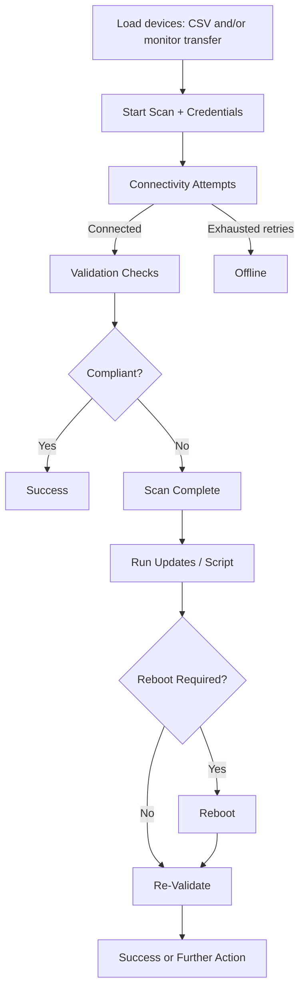

# Secure Deployment Runner

Secure Deployment Runner is a React + TypeScript operations dashboard for coordinating endpoint imaging handoff, compliance validation, and remote remediation workflows at scale. It is designed for IT teams that need a centralized interface to track device readiness, run deployment actions in bulk, and preserve an auditable history of each deployment run.

The current implementation uses a simulated PowerShell-style service layer to model real-world behavior (connectivity failures, retries, compliance outcomes, update/reboot lifecycle, script execution), making it useful for workflow validation, UI prototyping, and operator training before integrating with live infrastructure.

## Table of Contents

- [Overview](#overview)
- [Key Capabilities](#key-capabilities)
- [Architecture Summary](#architecture-summary)
- [Operational Personas and Responsibilities](#operational-personas-and-responsibilities)
- [Execution Playbooks](#execution-playbooks)
- [System Requirements](#system-requirements)
- [Installation](#installation)
- [Getting Started](#getting-started)
- [Usage Guide](#usage-guide)
  - [Image Monitor](#image-monitor)
  - [Deployment Runner](#deployment-runner)
  - [Imaging Script Tab](#imaging-script-tab)
  - [Build Output Tab](#build-output-tab)
- [Device Lifecycle and Status Model](#device-lifecycle-and-status-model)
- [Compliance Model](#compliance-model)
- [CSV Import Specification](#csv-import-specification)
- [Configuration and Tuning](#configuration-and-tuning)
- [Data Flow and Mock Service Behavior](#data-flow-and-mock-service-behavior)
- [Risk Controls and Safety Design](#risk-controls-and-safety-design)
- [KPIs and Reporting Guidance](#kpis-and-reporting-guidance)
- [Project Structure](#project-structure)
- [Technology Stack](#technology-stack)
- [Roadmap for Production Integration](#roadmap-for-production-integration)
- [Troubleshooting](#troubleshooting)
- [FAQ](#faq)
- [Operational Best Practices](#operational-best-practices)
- [Contributing](#contributing)
- [License](#license)

## Overview

Secure Deployment Runner supports a two-stage operational workflow:

1. **Imaging stage**: Track newly imaged systems, monitor compliance checks, and curate devices ready for downstream deployment.
2. **Deployment stage**: Validate, update, execute scripts, reboot, and re-scan endpoints either individually or in bulk.

The app includes:

- Multi-tab operational workspace (**Image Monitor**, **Deployment Runner**, **Imaging Script**, **Build Output**).
- Real-time status transitions with retry/cancel semantics.
- Compliance visibility for BIOS, DCU, Windows versioning, encryption, and security tooling health.
- Bulk-safe controls with confirmation gates for high-impact actions.
- Session-based credential prompt for deployment start.
- Run history and analytics views to inspect trends and failures over time.

## Key Capabilities

- **Imaging-to-runner handoff**: Transfer completed imaging devices into deployment workflow without re-entry.
- **CSV onboarding**: Import target devices with hostname/MAC validation and explicit row-level error reporting.
- **Retry-aware connection flow**: Simulated max retry + delay logic for unstable endpoints.
- **Granular compliance checks**: Device-level breakdown of required updates and failed controls.
- **Individual and bulk operations**:
  - Validate
  - Run updates
  - Execute post-imaging script
  - Reboot
  - Wake-on-LAN
  - Cancel / Remove
- **Operator safety controls**:
  - Re-scan-all confirmation modal
  - Credential capture before scan start
  - Disabled states to prevent invalid actions
- **Auditability**:
  - Run archive generation
  - Aggregate analytics for success/failure patterns
  - Live log stream paired with status table

## Architecture Summary

Secure Deployment Runner is a **frontend-first application** with mocked backend behavior.

- **UI Layer (React components)**
  - Handles tabs, modals, forms, status cards, tables, logs, and analytics visualizations.
- **State Layer (Context + reducer actions)**
  - Orchestrates deployment actions, selected device state, UI modal state, and history.
- **Service Layer (`services/deploymentService.ts`)**
  - Simulates remote operations: CSV parsing, validation scan, update/reboot flow, script execution, run archiving.
- **Utility Layer (`utils/helpers.ts`)**
  - Shared helper functions (e.g., sleep and MAC normalization).

> Note: `services/geminiService.ts` currently exists but is empty. No active AI integration is wired into runtime behavior at this time.

## Operational Personas and Responsibilities

| Persona | Primary Goals | Typical Actions in App | Success Criteria |
|---|---|---|---|
| Imaging Technician | Ensure endpoints are correctly imaged and ready for transfer | Monitor rack status, fix naming mismatches, transfer completed devices | Devices move to runner with accurate identity and initial compliance state |
| Deployment Operator | Bring devices into full compliance quickly and safely | Start scans, run updates, trigger scripts, perform re-scans | High success/compliance rate with minimal manual retries |
| Shift Lead / Manager | Oversee risk, throughput, and exceptions | Review progress, logs, and history analytics | Predictable run completion and clear audit trail for exceptions |
| Platform Engineer | Evolve tool from mock to production-integrated system | Validate service behavior, align contracts, plan backend integration | Reduced gap between UI behavior and backend orchestration APIs |

## Execution Playbooks

### Playbook A: Daily Compliance Sweep

Use this when a site has already completed imaging and only needs validation/remediation:

1. Import/update endpoint list via CSV.
2. Run initial scan and classify devices by terminal status (`Success`, `Scan Complete`, `Offline`).
3. Execute targeted updates on `Scan Complete` devices.
4. Re-scan only remediated devices, then run a full re-scan as final verification.
5. Capture archive and share shift summary (pass %, offline %, unresolved blockers).

### Playbook B: Imaging Handoff Window

Use this when devices are continuously arriving from imaging benches:

1. Keep **Image Monitor** active and transfer completed devices in waves.
2. Trigger scan per wave to reduce queue spikes and isolate issues quickly.
3. Use bulk actions only when status cohorts are homogeneous.
4. Escalate recurring failures (e.g., repeated offline, repeated BIOS update failure) to engineering backlog.

### Playbook C: Incident Recovery Run

Use after failed maintenance windows or network instability:

1. Increase retries/delay to absorb transient connectivity faults.
2. Start with validate-only sweep before updates to avoid compounding failures.
3. Apply updates in smaller batches and monitor logs continuously.
4. Tag and remove chronic failures from the active queue for separate triage.

## System Requirements

- **Node.js**: 18+ (recommended 20+)
- **npm**: 9+
- **Browser**: latest Chrome / Edge / Firefox / Safari
- **OS**: Windows, macOS, or Linux (for local UI development)

## Installation

1. **Clone repository**

   ```bash
   git clone <your-repo-url> secure-deployer
   cd secure-deployer
   ```

2. **Install dependencies**

   ```bash
   npm install
   ```

3. **Run development server**

   ```bash
   npm run dev
   ```

4. **Open app** at the printed local URL (typically `http://localhost:5173`).

### Production Build

```bash
npm run build
```

Preview build locally:

```bash
npm run preview
```

## Getting Started

### Quick Start (Operator Flow)

1. Open **Image Monitor** and review newly imaged devices.
2. Transfer completed devices into **Deployment Runner**.
3. (Optional) Import additional endpoints with a CSV file.
4. Configure deployment settings (retry count/delay, auto reboot).
5. Click **Start Scan** and enter credentials.
6. Review scan outcomes and apply remediation actions.
7. Use **Re-Scan All** after updates to confirm compliance closure.
8. Review **Deployment History** and analytics before closing the run.

### First Validation Scenario

Use 5–10 lab hosts and intentionally include mixed compliance states:

- some offline devices,
- some outdated BIOS/DCU/Windows,
- and at least one endpoint with missing security posture.

This gives you end-to-end confidence that your runbook and team operations map correctly to the UI lifecycle.

## Usage Guide

### Image Monitor

Use this tab to manage pre-deployment intake:

- View devices in a rack-style visualization.
- Inspect compliance outcomes and details.
- Rename/remove individual imaging records.
- Transfer selected or all completed devices to deployment queue.
- Clear selected entries that should not proceed.

### Deployment Runner

This is the primary execution workspace:

1. **Load devices** (from monitor transfer or CSV import).
2. **Set options**:
   - max retries,
   - retry delay,
   - auto reboot behavior.
3. **Start scan** (credential-gated).
4. Track outcomes in:
   - deployment progress summary,
   - device status table,
   - live logs.
5. Trigger device-specific or bulk actions.
6. Archive results in deployment history.

### Imaging Script Tab

Provides operator-facing script visibility so teams can review/align post-imaging execution expectations before running script actions against devices.

### Build Output Tab

Provides build/runtime output visibility useful for diagnosing frontend issues during testing or handoff demos.

## Device Lifecycle and Status Model

Typical status progression (simulated):

- `Pending`
- `Connecting`
- `Retrying...` (if transient failures)
- Validation statuses:
  - `Checking Info`
  - `Checking BIOS`
  - `Checking DCU`
  - `Checking Windows`
- Terminal scan statuses:
  - `Success`
  - `Scan Complete` (needs remediation)
  - `Offline`

Update flow statuses include:

- `Updating`
- `Updating BIOS/DCU/Windows`
- `Update Complete (Reboot Pending)`
- `Failed`
- `Success`

Script/remediation and cancellation states are also represented in the table and logs, allowing operators to track intervention outcomes without leaving the main runner context.

## Compliance Model

Current target versions are defined in app constants:

- **BIOS**: `A24`
- **DCU**: `5.1.0`
- **Windows**: `23H2`

Additional controls in the simulated compliance result:

- Disk encryption status
- CrowdStrike service status
- SCCM health status

A device is considered fully compliant only when all version checks and security posture checks pass.

## CSV Import Specification

CSV ingestion expects a header row containing columns that include:

- `Hostname`
- `MAC`

Matching is case-insensitive by header substring, so practical variants work as long as those keywords are present.

### Validation Behavior

- Missing hostname rows are skipped.
- MAC values are normalized and validated.
- Unsupported MAC characters are rejected.
- Incorrect normalized MAC length is rejected.
- Parser errors are surfaced to operator output.

### Example CSV

```csv
Hostname,MAC
HQ-LT-001,00:1A:2B:3C:4D:5E
BRANCH-SFF-007,10-20-30-40-50-60
```

## Configuration and Tuning

Deployment Runner exposes operational tuning controls for scan reliability and throughput:

- **Max retries**: how many connection attempts per endpoint.
- **Retry delay**: wait time between attempts.
- **Auto reboot**: automatically reboot devices after updates when required.

### Recommended Starting Values

- Lab: retries `1-2`, delay `1-2s`
- Stable LAN: retries `2-3`, delay `2-3s`
- WAN / unstable sites: retries `3-5`, delay `3-10s`

Tune based on endpoint responsiveness and maintenance window constraints.

## Data Flow and Mock Service Behavior

This project intentionally simulates backend behavior for deterministic UI iteration.

- **CSV parse**: `parseDevicesFromCsv` validates rows and emits device records/errors.
- **Scan flow**: `runDeploymentFlow` + `validateDevice` apply staged status transitions and randomized pass/fail outcomes.
- **Re-validation**: `validateDevices` rechecks selected/all devices.
- **Update flow**: `updateDevice` simulates component updates + reboot dependency.
- **Script flow**: `executeScript` returns probabilistic success/failure.
- **History**: `generateRunArchive` aggregates counts and failure categories.

This structure is intentionally close to real orchestration interfaces, minimizing refactor risk when introducing real remote execution APIs.

### Simulated End-to-End Sequence



### Service Function Intent Matrix

| Function | Intent | Input Focus | Output Focus | Operator Impact |
|---|---|---|---|---|
| `parseDevicesFromCsv` | Normalize/validate import rows | CSV parser result object | Valid devices + explicit validation errors | Prevents bad records from entering run queue |
| `runDeploymentFlow` | Execute scan pass for loaded queue | Device list + retry settings + callbacks | Progressive per-device status updates | Drives initial readiness signal for remediation |
| `validateDevices` | Re-run compliance validation | Existing devices subset/all | Updated status snapshots | Enables closure checks after remediation |
| `updateDevice` | Simulate update pipeline | Single device + settings + callbacks | Update result, reboot-pending states | Models operational patching outcomes and failures |
| `executeScript` | Simulate script execution outcome | Single device | Boolean success/failure | Captures post-imaging script completion path |
| `generateRunArchive` | Aggregate deployment telemetry | Final device list | Run summary metrics | Supports shift reporting and trend analysis |

## Risk Controls and Safety Design

Operational safety controls already present in the UX include:

- **Credential gating** before starting scans to avoid accidental unauthorized actions.
- **Confirmation modal** before full re-scan operations.
- **Disabled action states** when prerequisites are not met (e.g., no selected devices).
- **Terminal status visibility** to prevent blind bulk actions across mixed health states.

Recommended production hardening additions:

- Mandatory change ticket reference for bulk destructive operations.
- Four-eyes approval for delete/remove operations at scale.
- Immutable audit records for credentialed actions.
- Role-based scopes for scan vs remediation vs administrative settings changes.

## KPIs and Reporting Guidance

Track these KPIs by shift, site, and device cohort:

| KPI | Formula | Why it matters |
|---|---|---|
| First-pass compliance rate | `Success after initial scan / total scanned` | Measures baseline endpoint health and image quality |
| Remediation success rate | `Devices moved from Scan Complete to Success / remediated devices` | Shows effectiveness of update/script process |
| Offline rate | `Offline / total scanned` | Indicates network, power, or endpoint availability issues |
| Mean time to compliance (MTTC) | `Avg(time from first scan start to Success)` | Captures operational efficiency end-to-end |
| Repeat failure ratio | `Devices failing same step >1 time / total failed` | Highlights structural issues needing engineering fixes |

Suggested reporting cadence:

- **Per wave** during active deployment windows.
- **End-of-shift** summary for operational handoff.
- **Weekly trend review** to prioritize platform improvements.

## Project Structure

```text
secure-deployer/
├── App.tsx                         # App shell, tabs, constants, high-level orchestration
├── index.tsx                       # React entrypoint
├── types.ts                        # Shared domain types
├── contexts/
│   └── AppContext.tsx              # Global state + reducer actions
├── components/
│   ├── ImageMonitor.tsx
│   ├── DeviceStatusTable.tsx
│   ├── DeploymentProgress.tsx
│   ├── LogViewer.tsx
│   ├── BulkActions.tsx
│   ├── DeploymentHistory.tsx
│   ├── DeploymentAnalytics.tsx
│   ├── SecureCredentialModal.tsx
│   ├── RescanConfirmationModal.tsx
│   └── ...                         # Additional UI modules and detail modals
├── services/
│   ├── deploymentService.ts        # Mock orchestration and workflow simulation
│   ├── powershellScript.ts         # Script content/source helpers
│   └── geminiService.ts            # Placeholder (currently empty)
├── utils/
│   └── helpers.ts                  # Utility helpers
├── package.json
└── README.md
```

## Technology Stack

| Technology | Version (repo) | Purpose |
|---|---:|---|
| React | 19.2.x | UI rendering and component architecture |
| TypeScript | 5.8.x | Type-safe application logic |
| Vite | 6.2.x | Dev server and production build tooling |
| Papa Parse | 5.5.x | CSV parsing and import pipeline |

## Roadmap for Production Integration

To connect this UI to live infrastructure, prioritize the following sequence:

1. Replace mock service functions with authenticated API client calls.
2. Add backend job orchestration for long-running deployment actions.
3. Implement durable logs and per-device action audit trail.
4. Add RBAC + SSO (e.g., Entra ID/Okta) for operator controls.
5. Enforce secrets handling via vault-backed credential brokering.
6. Introduce signed action approvals for destructive operations.
7. Add unit/integration tests around reducer/service boundaries.

## Troubleshooting

### App fails to start

- Verify Node version (`node -v`) is 18+.
- Clear install artifacts and reinstall:

  ```bash
  rm -rf node_modules package-lock.json
  npm install
  npm run dev
  ```

### CSV import returns zero valid devices

- Confirm header row exists.
- Ensure both `Hostname` and `MAC` columns are present.
- Check MAC formatting (only hex + separators).

### Devices appear frequently offline in tests

- Increase retry count and delay in runner settings.
- Validate your expected behavior—offline simulation is intentional in mock mode.

### Updates fail unpredictably

- Expected in current simulation model (probabilistic outcome).
- Use re-validation and reruns to test remediation workflows.

## FAQ

### Is this production-ready for real remote deployment?

Not yet. The app is intentionally frontend-first with simulated service outcomes. It is best used for workflow design, training, and UX validation until backend orchestration, authn/authz, and durable audit infrastructure are integrated.

### Why do status outcomes vary between runs?

Core service functions intentionally use probabilistic outcomes to mimic real-world variability (connectivity and update success/failure). This helps teams rehearse exception handling and escalation paths.

### Should we use bulk actions for all devices?

Only for homogeneous cohorts (same failure class and expected remediation path). Mixed cohorts are safer to process in smaller batches to avoid masking targeted failures.

### How should we approach backend integration safely?

Start by preserving current service contracts and replacing internals with API calls. Then add queue orchestration, idempotency keys, and immutable audit logs before enabling high-scale production actions.

## Operational Best Practices

- **Stage before scale**: Validate flow on a pilot batch before bulk deployment.
- **Use re-scan gates**: Confirm compliance after every mass update wave.
- **Keep artifacts**: Preserve run history for change and incident reviews.
- **Separate runbooks**: Maintain distinct procedures for imaging, remediation, and escalation.
- **Document exception paths**: Record how to handle repeated offline, update failures, and script errors.

## Contributing

Contributions are welcome. For high-quality PRs:

- Keep UI and service-layer changes aligned.
- Update README sections when workflow behavior changes.
- Prefer clear action naming and explicit status transitions.
- Include test evidence for non-trivial reducer/service updates.

## License

This project is provided as-is for secure deployment workflow prototyping and operations dashboard development.
