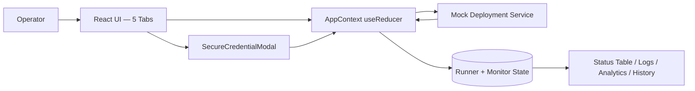
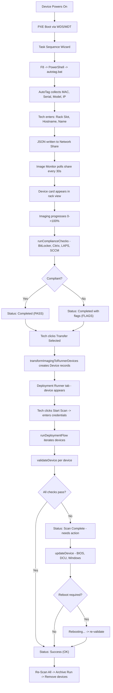
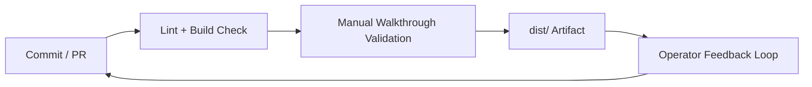
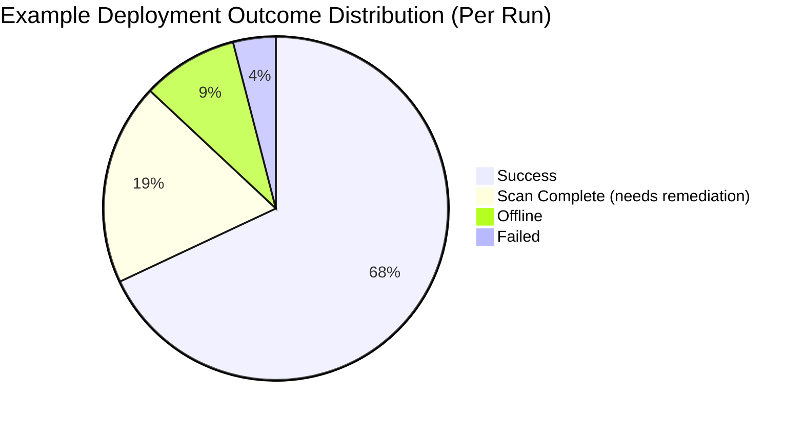
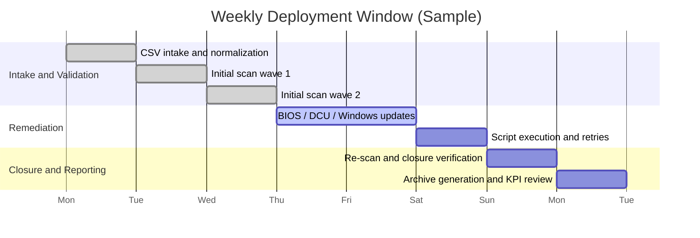

# Secure Deployment Runner

> **Status key:** 🟢 Done · 🟠 In Progress · 🔵 Planned · 🔄 Recovery/Rebuild · 📝 Documentation Pending

---

## 🎯 Overview

Secure Deployment Runner is a React + TypeScript operations dashboard for coordinating endpoint
imaging handoff, compliance validation, and remote remediation workflows at scale. It is designed
for IT teams that need a centralized interface to track device readiness, run deployment actions
in bulk, and preserve an auditable history of each deployment run.

The current implementation uses a simulated PowerShell-style service layer to model real-world
behavior — connectivity failures, retries, compliance outcomes, update/reboot lifecycle, and script
execution — making it useful for workflow validation, UI prototyping, and operator training before
integrating with live infrastructure.

**Primary stakeholders:** imaging technicians, deployment operators, shift leads, and platform
engineers preparing production integration. Success looks like faster remediation loops, safer bulk
execution, and complete run evidence for operations and leadership review.

### Outcomes

- Maintain a reliable imaging-to-deployment handoff with minimal manual re-entry.
- Improve operator decision speed with live statuses, compliance drill-downs, and logs.
- Reduce high-impact mistakes through credential prompts, confirmation gates, and disabled invalid
  actions.
- Preserve run-level auditability with history archives and analytics views.
- Keep contracts close to production orchestration patterns so backend integration requires minimal
  refactor.

---

## 📌 Scope & Status

| Area | Status | Notes | Next Milestone |
|---|---|---|---|
| Core deployment actions | 🟢 Done | Validate/update/script/reboot/cancel/remove workflows run via mock service layer. | Add regression tests around transfer and remediation edge cases. |
| Imaging intake + transfer | 🟢 Done | Image Monitor transfer (selected/all), rename/remove, and filtering are available. | Add regression tests around transfer edge cases. |
| CSV onboarding | 🟢 Done | Hostname/MAC normalization with explicit row-level error handling is present. | Add malformed-header and parser-fixture tests. |
| Quality gates | 🟢 Done | Build passes; lint passes with 0 errors and 0 warnings. | Add automated unit/integration tests (Sprint +2). |
| CI/CD + observability automation | 🟢 Done | GitHub Actions CI workflow runs lint + typecheck + build + artifact upload on every push and PR. | Add observability signals (error rate dashboards, alerting). |
| Production API/auth integration | 🔵 Planned | Runtime behavior is intentionally simulated. | Introduce API adapter + environment-driven service selection. |
| PXE / zero-touch imaging | 🔵 Planned | PowerShell script exists; full zero-touch requires WDS/MDT config. | See `docs/AUTOMATION.md` for tiers. |
| End-to-end process documentation | 🟢 Done | `docs/PROCESS.md` covers full add→image→finish→remove SOP. | Keep in sync with service changes. |
| Capacity & scalability guidance | 🟢 Done | `docs/CAPACITY.md` covers wave sizing, code-backed limits, scaling paths. | Update when scan loop is parallelised. |

> **Scope note:** Current scope focuses on local/operator workflow rehearsal and simulation.
> Deferred items include production endpoint orchestration, immutable backend audit logs, RBAC/SSO
> hardening, and vault-backed secrets brokering.

---

## 🏗️ Architecture

Secure Deployment Runner is a frontend-first architecture. React components handle operator
workflows. A centralized reducer in `AppContext` (`contexts/AppContext.tsx`) owns all state
mutations and action orchestration. A simulated deployment service boundary
(`services/deploymentService.ts`) mirrors the contracts a production backend would expose. Device
records enter via Image Monitor transfers or CSV import, then flow through action-driven lifecycle
transitions that drive the status table, logs, and run history outputs.


```mermaid
flowchart LR
  A[Operator] --> B[React UI — 5 Tabs]
  B --> C[AppContext useReducer]
  C --> D[Mock Deployment Service]
  D --> C
  C --> E[(Runner + Monitor State)]
  E --> F[Status Table / Logs / Analytics / History]
  B --> G[SecureCredentialModal]
  G --> C
```

### End-to-End Data Flow (Imaging → Deployment)


```mermaid
flowchart TD
  A[Device Powers On] --> B[PXE Boot via WDS/MDT]
  B --> C[Task Sequence Wizard]
  C --> D["F8 -> PowerShell -> autotag.bat"]
  D --> E["AutoTag collects MAC, Serial, Model, IP"]
  E --> F["Tech enters: Rack Slot, Hostname, Name"]
  F --> G[JSON written to Network Share]
  G --> H[Image Monitor polls share every 30s]
  H --> I[Device card appears in rack view]
  I --> J["Imaging progresses 0->100%"]
  J --> K["runComplianceChecks - BitLocker, Citrix, LAPS, SCCM"]
  K --> L{Compliant?}
  L -- Yes --> M["Status: Completed (PASS)"]
  L -- No --> N["Status: Completed with flags (FLAGS)"]
  M --> O[Tech clicks Transfer Selected]
  N --> O
  O --> P[transformImagingToRunnerDevices creates Device records]
  P --> Q[Deployment Runner tab - device appears]
  Q --> R["Tech clicks Start Scan -> enters credentials"]
  R --> S[runDeploymentFlow iterates devices]
  S --> T[validateDevice per device]
  T --> U{All checks pass?}
  U -- Yes --> V["Status: Success (OK)"]
  U -- No --> W["Status: Scan Complete - needs action"]
  W --> X["updateDevice - BIOS, DCU, Windows"]
  X --> Y{Reboot required?}
  Y -- Yes --> Z["Rebooting... -> re-validate"]
  Y -- No --> V
  Z --> V
  V --> AA["Re-Scan All -> Archive Run -> Remove devices"]
```

### Component Responsibility Map

| Component | File | Responsibility | Key Interfaces |
|---|---|---|---|
| App shell + tab router | `App.tsx` | Renders active tab, exports version constants, mounts modals | `activeTab`, `TARGET_BIOS_VERSION`, `TARGET_DCU_VERSION`, `TARGET_WIN_VERSION` |
| Global state + reducer | `contexts/AppContext.tsx` | Single source of truth for runner + monitor + UI state | `START_DEPLOYMENT_CONFIRMED`, `VALIDATE_DEVICES`, `BULK_UPDATE`, `ARCHIVE_RUN` |
| Deployment service | `services/deploymentService.ts` | Simulated scan, update, reboot, script, archive, RDP file gen | `runDeploymentFlow`, `validateDevice`, `updateDevice`, `runComplianceChecks`, `buildRemoteDesktopFile` |
| PowerShell script | `services/powershellScript.ts` | Exposes WinPE intake script for operator review in UI | Script string constant |
| Image Monitor | `components/ImageMonitor.tsx` | Polls imaging share, shows device intake pipeline | Device polling, transfer action dispatch |
| Image Rack | `components/ImageRack.tsx` | Visual rack grid (16 slots per rack), expandable device cards | `DeviceCard`, `EmptySlotCard`, compliance status icons |
| Device Status Table | `components/DeviceStatusTable.tsx` | Per-device compliance checklist, update/reboot actions, script exec | `StatusBadge`, `ComplianceChecklistItem`, context menu |
| Bulk Actions | `components/BulkActions.tsx` | Bulk update / validate / execute / cancel / remove / run / install / delete | `onDeployOperation`, file selector state |
| Deployment History | `components/DeploymentHistory.tsx` | Run archive display, CSV export, analytics charts (Recharts) | `HistoryItem`, `generateRunArchive`, bar + trend charts |
| Remote Desktop | `components/RemoteDesktop.tsx` | Generates `.rdp` files for operator session access | `buildRemoteDesktopFile` wrapper |
| Credential Modal | `components/SecureCredentialModal.tsx` | Session-only credential capture, never persisted | Single-use dispatch to context |
| Domain types | `src/types.ts` | All TypeScript interfaces: Device, ImagingDevice, DeploymentRun, etc. | `Device`, `DeploymentStatus`, `DeviceFormFactor`, `ComplianceResult` |
| Helpers | `utils/helpers.ts` | MAC normalization, hostname-based device type detection, sleep util | `normalizeMacAddress`, `detectDeviceType` |

---

## 🖥️ Application Tabs — What Each Does and How

### Tab 1: Image Monitor

**What it does:** Shows every device currently being imaged. Devices appear automatically when the
AutoTag PowerShell script runs during PXE imaging. Each device is rendered as an expandable card
inside a rack grid (16 slots per rack view). After imaging completes, the monitor runs post-image
compliance checks and marks devices ready for transfer.

**How it does it:** `components/ImageMonitor.tsx` reads `ImagingDevice` objects from
`state.monitor.devices`. `components/ImageRack.tsx` renders cards in a CSS grid. Each card shows:
hostname, rack slot, tech name, model, serial, MAC, IP, progress bar (0–100%), and compliance
status icons (BitLocker, LAPS, Citrix, SCCM). The transfer action dispatches
`TRANSFER_IMAGING_DEVICES_TO_RUNNER`, which calls `transformImagingToRunnerDevices` in
`deploymentService.ts` to convert `ImagingDevice` → `Device` objects for the runner queue.

**What it uses:**
- `components/ImageRack.tsx` — rack card layout, slot management, expandable detail, inline hostname
  editing, revalidation button
- `components/ComplianceDetailsModal.tsx` — per-device compliance drill-down
- `runComplianceChecks()` in `deploymentService.ts` — checks BitLocker volume status, Citrix
  Workspace installed, LAPS installed, SCCM client installed and running
- `contexts/AppContext.tsx` actions: `ADD_IMAGING_DEVICE`, `UPDATE_IMAGING_DEVICE`,
  `REMOVE_IMAGING_DEVICE`, `TRANSFER_IMAGING_DEVICES_TO_RUNNER`

**Why it exists:** Imaging and deployment are run by different workflows (and sometimes different
people). The monitor stage creates a clean checkpoint: a device is not eligible for deployment scan
until it has finished imaging and passed an initial compliance gate. This prevents deploying
partially-imaged or non-compliant devices into the runner queue.

---

### Tab 2: Deployment Runner

**What it does:** The core remediation workspace. Operators load devices (from Image Monitor
transfer or CSV), configure scan settings, start a credential-gated scan, review per-device
compliance results, apply updates, execute scripts, reboot devices, and verify closure. All actions
are logged in real time.

**How it does it:** `App.tsx` orchestrates the runner UI. Device rows live in `state.runner.devices`
(a `Device[]` array managed by the reducer). The scan flow is:
1. Operator clicks **Start Scan** → `SecureCredentialModal` opens.
2. Credentials dispatched via `START_DEPLOYMENT_CONFIRMED`.
3. `runDeploymentFlow()` in `deploymentService.ts` iterates devices sequentially, calling
   `validateDevice()` for each.
4. `validateDevice()` steps through: Wake-on-LAN → connect (with retry loop) → gather system
   info → check BIOS/DCU/Windows versions → check encryption/CrowdStrike/SCCM.
5. Per-device status transitions are dispatched back to the reducer in real time.
6. Operator sees live status + logs; takes action on `Scan Complete` devices.

**What it uses:**
- `services/deploymentService.ts` — `runDeploymentFlow`, `validateDevice`, `updateDevice`,
  `executeScript`, `performDeploymentOperation`, `generateRunArchive`
- `components/DeviceStatusTable.tsx` — renders compliance checklist, update/reboot/script buttons
  per device
- `components/BulkActions.tsx` — bulk update / validate / execute / cancel / remove; file picker
  for run/install/delete operations
- `components/LogViewer.tsx` — real-time log stream from `state.runner.logs`
- `components/DeploymentHistory.tsx` — shows last 10 archived runs with analytics
- `contexts/AppContext.tsx` — all runner state including `devices`, `logs`, `settings`,
  `deploymentState`, `history`, `batchHistory`

**Why it exists:** The Deployment Runner closes the loop. Imaging gets a device to a baseline OS
state; the runner validates every compliance dimension and automates the remediation steps
(BIOS updates, DCU updates, Windows updates, script execution) that would otherwise require manual
per-device work.

---

### Tab 3: Imaging Script Viewer

**What it does:** Displays the full PowerShell script that runs in WinPE during PXE imaging (the
AutoTag intake script). Operators and engineers can read, copy, and understand exactly what the
script collects and where it writes output.

**How it does it:** `components/ImagingScriptViewer.tsx` renders the script string exported from
`services/powershellScript.ts` in a scrollable monospace panel with syntax highlighting. No
execution happens in this tab — it is read-only reference.

**What it uses:**
- `services/powershellScript.ts` — PowerShell script constant (the full WinPE intake script)
- React state for copy-to-clipboard and expand/collapse

**Why it exists:** The imaging intake script is the invisible half of the workflow. If operators
don't understand what AutoTag collects and writes, they can't troubleshoot mismatches between Image
Monitor and physical device state. This tab gives immediate access to the script without needing to
RDP into a WDS server or dig through MDT share folders.

**Script behavior summary:**
- Runs in WinPE environment (before OS installation)
- Prompts tech for: rack slot, hostname, technician name
- Automatically collects: MAC address, IP address, model, serial number, asset tag
- Writes a JSON record to a configured network share path
- Image Monitor polls that share path to populate the rack view

---

### Tab 4: Build Output

**What it does:** Simulates a build/compilation event and streams the log output in real time. This
is a demonstration of the log streaming UI pattern used throughout the application.

**How it does it:** `components/BuildOutput.tsx` uses a local `useState` + async loop to push
simulated build log lines into the component with `sleep()` delays, showing the same visual pattern
used by the real deployment log stream.

**Why it exists:** Provides a safe, always-available demonstration of the real-time log rendering
used in the Deployment Runner, allowing UI testing and stakeholder demos without needing a live
scan session.

---

### Tab 5: Remote Desktop

**What it does:** Generates a pre-configured `.rdp` file for a selected device. The operator can
download and open the file to start an RDP session to that device for manual verification or
remediation.

**How it does it:** `components/RemoteDesktop.tsx` calls `buildRemoteDesktopFile()` from
`deploymentService.ts`, which constructs an RDP file string with the device's hostname/IP, optional
username pre-fill, and standard security settings. The file is created via a Blob download in the
browser.

**What it uses:**
- `services/deploymentService.ts:buildRemoteDesktopFile()` — RDP file string builder
- `components/RemoteCredentialModal.tsx` — captures optional username for RDP pre-fill
- Browser `Blob` + `URL.createObjectURL` for download

**Why it exists:** When automated deployment actions can't fully remediate a device (e.g., a script
fails, a manual config is needed), RDP provides the fallback. The generated file encapsulates
connection details so the operator doesn't have to look up the device's IP and configure a session
manually.

---

## 🚀 Setup & Runbook

### Prerequisites

- Node.js 18+ (recommended: Node.js 20 LTS)
- npm 9+
- Browser: latest Chrome, Edge, Firefox, or Safari
- OS: Windows, macOS, or Linux

### Commands

| Step | Command | Expected Result |
|---|---|---|
| Install | `npm install` | Dependencies install from lockfile and package manifest. |
| Run (dev) | `npm run dev` | Vite dev server starts; local URL printed to terminal. |
| Build | `npm run build` | Production bundle emitted to `dist/`. |
| Lint | `npm run lint` | Target is zero errors (known failing baseline; see Known Gaps). |
| Preview | `npm run preview` | Serves built `dist/` assets locally for smoke testing. |

### Serving on a LAN (for team access)

```bash
# Build first
npm run build

# Serve dist/ on port 3000 (any static file server works)
npx serve dist -p 3000 --cors

# Or with Python (no install needed)
cd dist && python3 -m http.server 3000
```

Other team members access via `http://<server-ip>:3000`. For remote/WAN access, place behind a
reverse proxy (nginx, Caddy) with HTTPS + VPN. See `docs/AUTOMATION.md` for full remote access
patterns.

### Troubleshooting

| Symptom | Likely Cause | Resolution |
|---|---|---|
| App fails to start | Node / npm version mismatch | Confirm Node 18+; delete `node_modules`; run `npm install` again. |
| CSV imports 0 devices | Missing `Hostname` / `MAC` headers or invalid MAC format | Check header row; correct MAC to `XX:XX:XX:XX:XX:XX` or `XX-XX-XX-XX-XX-XX`. |
| Most devices show Offline | Mock service simulates instability | Increase Max Retries and Retry Delay in Advanced Settings; re-scan. |
| Device not appearing in Image Monitor | AutoTag didn't publish successfully or network share unreachable | Re-run `autotag.bat`; check network share path and credentials. |
| Scan starts then hangs | Long retry chain on a large cohort | Reduce cohort size; cancel and restart with shorter retry settings. |

---

## ✅ Testing & Quality Evidence

Current quality evidence is static analysis (`lint`, `build`) plus manual operator walkthroughs
across tabs and remediation flows. This validates workflow UX and state transitions but remains
short of automated unit/integration/e2e coverage.

| Test Type | Command / Location | Current Result | Evidence Link |
|---|---|---|---|
| Unit | Not yet implemented | n/a | Planned — Sprint +2 |
| Integration | Not yet implemented | n/a | Planned — Sprint +2 |
| Static lint | `npm run lint` | **Pass** — 0 errors, 0 warnings | `package.json` + `.github/workflows/ci.yml` |
| Build | `npm run build` | **Pass** | `package.json` + `.github/workflows/ci.yml` |
| E2E / Manual | Operator walkthrough | In use for mock workflow validation | `App.tsx`, `components/`, `contexts/AppContext.tsx` |

### Known Quality Gaps

- No automated unit, integration, or e2e test harness is committed (planned Sprint +2).
- Lint and build pass cleanly; CI runs on every push and pull request via `.github/workflows/ci.yml`.

---

## 🔐 Security, Risk & Reliability

| Risk | Impact | Current Control | Residual Risk |
|---|---|---|---|
| Accidental bulk action on wrong cohort | High | Confirmation modal + selection gating + disabled states for invalid actions | Medium |
| Credential exposure during scan start | High | Session-only credential modal — never persisted to localStorage or state | Medium-High |
| Mock-vs-production behavior gap | Medium | Explicit simulation boundary; service contracts documented | Medium |
| Failure visibility gaps | Medium | Live logs, status table color coding, run history, analytics | Low-Medium |
| Offline device left in active queue | Low | Manual remove action; offline state is clearly labeled | Low |

### Reliability Controls

- **Retry + delay tuning:** `maxRetries` and `retryDelay` in `state.runner.settings` — configurable
  per run without code changes.
- **Re-scan loops:** Operators can re-validate any subset of devices after remediation, then run
  re-scan-all for final closure.
- **Deterministic reducer:** All state transitions happen via typed `Action` dispatches in
  `contexts/AppContext.tsx` — no state mutation outside the reducer.
- **Run archive:** `generateRunArchive()` in `deploymentService.ts` produces an immutable summary
  at the end of each run, retained in `state.runner.history` (last 10 runs).
- **Credential isolation:** `SecureCredentialModal.tsx` dispatches credentials as a one-time
  ephemeral payload; they are never written to component state or browser storage.

### Recommended Production Hardening (When Integrating Real Backend)

- Require change ticket references before scan authorization.
- Enforce four-eyes approval for destructive bulk operations.
- Write immutable, signed audit records for all credentialed actions.
- Apply RBAC — scoped permissions for scan, remediate, and admin roles.
- Route secrets through a vault (Azure Key Vault, HashiCorp Vault, AWS Secrets Manager) instead of
  interactive prompts.
- Enable LAPS for per-device local admin rotation.

---

## 🔄 Delivery & Observability


```mermaid
flowchart LR
  A[Commit / PR] --> B[Lint + Build Check]
  B --> C[Manual Walkthrough Validation]
  C --> D[dist/ Artifact]
  D --> E[Operator Feedback Loop]
  E --> A
```

| Signal | Source | Threshold / Expectation | Owner |
|---|---|---|---|
| Lint errors | ESLint | 0 errors target | Frontend maintainer |
| Build pass | Vite | Must pass for any release candidate | Frontend maintainer |
| First-pass compliance rate | Deployment history analytics | Improve run over run | Shift lead |
| Offline rate | Status table / history | Investigate spikes > 10% | Deployment operator |
| MTTC (Mean Time to Compliance) | Run archive metrics | Reduce with tuning and automation | Ops leadership |
| Script execution failure rate | Batch history | Alert if > 15% | Platform engineer |

---

## 🗺️ Roadmap

| Milestone | Status | Target | Owner | Dependency / Blocker |
|---|---|---|---|---|
| Restore green lint baseline | 🟢 Done | Completed | Frontend maintainer | — |
| Add CI workflow (`lint` + `build`) | 🟢 Done | Completed | Frontend maintainer | — |
| Create supplementary docs (PROCESS, CAPACITY, AUTOMATION) | 🟢 Done | Completed | Frontend maintainer | — |
| Add test foundation (unit + reducer tests) | 🔵 Planned | Sprint +2 | Frontend maintainer | Test harness setup |
| Backend adapter POC | 🔵 Planned | Sprint +3 | Platform engineer | API contract finalization |
| Parallelise scan loop for large cohorts | 🔵 Planned | Sprint +3 | Platform engineer | Service layer refactor; see `docs/CAPACITY.md` |
| RBAC + SSO + audit hardening | 🔵 Planned | Sprint +4 | Platform + security | Identity + policy dependencies |
| Zero-touch PXE imaging (Tier 3+) | 🔵 Planned | Sprint +5 | Platform engineer | WDS/MDT server configuration; see `docs/AUTOMATION.md` |

---

## 📎 Evidence Index

- [Application shell + tab router](./App.tsx)
- [Global state reducer](./contexts/AppContext.tsx)
- [Mock deployment service](./services/deploymentService.ts)
- [PowerShell WinPE script](./services/powershellScript.ts)
- [Image Monitor workflow](./components/ImageMonitor.tsx)
- [Image Rack card grid](./components/ImageRack.tsx)
- [Device status + compliance table](./components/DeviceStatusTable.tsx)
- [Bulk actions panel](./components/BulkActions.tsx)
- [Deployment history + analytics](./components/DeploymentHistory.tsx)
- [Remote desktop RDP generator](./components/RemoteDesktop.tsx)
- [Domain type contracts](./src/types.ts)
- [Helper utilities](./utils/helpers.ts)
- [Project scripts + dependencies](./package.json)
- [Full process SOP](./docs/PROCESS.md)
- [Capacity + scalability guide](./docs/CAPACITY.md)
- [Automation tiers + PXE guide](./docs/AUTOMATION.md)
- [Technical architecture deep-dive](./docs/ARCHITECTURE.md)

---

## 🧾 Documentation Freshness

| Cadence | Action | Owner |
|---|---|---|
| Per major merge | Update Scope & Status table, Known Gaps, Roadmap | Repo maintainer |
| Weekly | Verify all commands produce expected results; check evidence links | Frontend maintainer |
| Monthly | Audit full README quality against template; update KPIs | Engineering lead |

---

## ✔️ Pre-Merge Quality Checklist

- [x] Status legend is present and used consistently throughout
- [x] Architecture Mermaid diagram renders in GitHub markdown preview
- [x] End-to-end data flow diagram renders in GitHub markdown preview
- [x] Setup commands are runnable and validated locally
- [x] Testing table includes current evidence and known gaps
- [x] Risk and reliability controls are documented
- [x] Roadmap includes next milestones with owners
- [x] Evidence links resolve to existing files in the repository
- [x] `docs/` supplementary files exist and are linked in Evidence Index
- [x] README reflects current implementation state accurately

---

## 📚 Detailed Reference

### Key Capabilities

- **Imaging-to-runner handoff:** Transfer completed imaging devices into the deployment workflow
  without re-entry. Implemented via `TRANSFER_IMAGING_DEVICES_TO_RUNNER` reducer action and
  `transformImagingToRunnerDevices()` in `deploymentService.ts`.
- **CSV onboarding:** Import target devices with hostname/MAC validation and explicit row-level
  error reporting. Implemented via `parseDevicesFromCsv()` and Papa Parse (`papaparse@5.5.x`).
- **Retry-aware connection flow:** Max retry + delay configuration (`maxRetries`, `retryDelay`)
  tunable per run. Retry logic lives inside `validateDevice()` in `deploymentService.ts`.
- **Granular compliance checks:** BIOS, DCU, Windows versions; BitLocker encryption; CrowdStrike
  endpoint protection; SCCM client health. Each check is individually surfaced in the device row
  via `ComplianceChecklistItem` in `components/DeviceStatusTable.tsx`.
- **Individual and bulk operations:**
  - Validate (re-check compliance)
  - Run updates (BIOS / DCU / Windows)
  - Execute post-imaging script
  - Reboot
  - Wake-on-LAN
  - Cancel ongoing task
  - Remove from queue
  - File operations: Run / Install / Delete
- **Operator safety controls:** Re-scan-all confirmation modal; session-only credential prompt;
  disabled action states when prerequisites are unmet; selection-gated bulk actions.
- **Auditability:** Run archive via `generateRunArchive()`; aggregate analytics (Recharts bar and
  trend charts); live log stream; deployment history (last 10 runs).

### Operational Personas and Responsibilities

| Persona | Primary Goals | Typical Actions | Success Criteria |
|---|---|---|---|
| Imaging Technician | Ensure endpoints are correctly imaged and ready for transfer | Monitor rack, fix naming, run AutoTag, transfer completed devices | Devices move to runner with accurate identity + initial compliance |
| Deployment Operator | Bring devices into full compliance quickly and safely | Start scans, run updates, trigger scripts, re-scan | High success/compliance rate with minimal manual retries |
| Shift Lead / Manager | Oversee risk, throughput, and exceptions | Review progress, logs, history analytics, shift handoffs | Predictable run completion; clear audit trail for exceptions |
| Platform Engineer | Evolve tool from mock to production-integrated system | Validate service behavior, align API contracts, plan backend integration | Reduced gap between UI behavior and backend orchestration |

### Execution Playbooks

#### Playbook A: Daily Compliance Sweep
1. Import or update endpoint list via CSV upload.
2. Run initial scan; classify devices by terminal status (`Success`, `Scan Complete`, `Offline`).
3. Execute targeted updates on `Scan Complete` devices.
4. Re-scan remediated devices only; then run a full re-scan-all for final verification.
5. Capture archive and share shift summary (pass %, offline %, unresolved blockers).

#### Playbook B: Imaging Handoff Window
1. Keep **Image Monitor** active; transfer completed devices in waves.
2. Trigger a scan per wave to reduce queue spikes and isolate issues quickly.
3. Use bulk actions only when status cohorts are homogeneous (all `Scan Complete`, not mixed).
4. Escalate recurring failures (repeated offline, repeated BIOS failure) to engineering backlog.

#### Playbook C: Incident Recovery Run
1. Increase retries/delay to absorb transient connectivity faults.
2. Start with validate-only sweep before applying updates — avoid compounding failures.
3. Apply updates in smaller batches; monitor logs continuously.
4. Tag and remove chronic failures from active queue for separate triage.

### Device Lifecycle and Status Model

```
IMAGING LIFECYCLE (Image Monitor)
──────────────────────────────────
ImagingDevice:
  Imaging (0–100% progress)
    → Checking Compliance
      → runComplianceChecks: BitLocker · LAPS · Citrix · SCCM
    → Completed ✅  (or Completed with flags ⚠️)
    → Ready for Transfer

SCANNING LIFECYCLE (Deployment Runner)
───────────────────────────────────────
Pending
  → Pending Validation
  → Waking Up  (Wake-on-LAN signal sent)
  → Connecting  (TCP connection attempt)
  → Retrying...  (if max retries not yet reached)
  → Checking Info  (model, serial, asset tag, disk space, RAM)
  → Checking BIOS  (compare to TARGET_BIOS_VERSION = 'A24')
  → Checking DCU   (compare to TARGET_DCU_VERSION = '5.1.0')
  → Checking Windows  (compare to TARGET_WIN_VERSION = '23H2')
  → ┌─ Success  (all checks pass)
    ├─ Scan Complete  (one or more checks failed — needs remediation)
    └─ Offline  (retries exhausted)

UPDATE LIFECYCLE
────────────────
Scan Complete
  → Updating
  → Updating BIOS  (if BIOS out of date)
  → Updating DCU   (if DCU out of date)
  → Updating Windows  (if Windows out of date)
  → Update Complete (Reboot Pending)  |  Failed
  → Rebooting...  (if auto-reboot enabled or manual reboot triggered)
  → Success  |  Failed

DEPLOYMENT / SCRIPT LIFECYCLE
──────────────────────────────
Pending File  (script attached to device)
  → Ready for Execution
  → Executing Script
  → Execution Complete  |  Execution Failed

FILE OPERATION LIFECYCLE
─────────────────────────
(Select file → choose Run / Install / Delete)
  → Running / Installing / Deleting
  → Operation Complete  |  Operation Failed
```

### Compliance Model

Target versions are defined as exported constants in `App.tsx`:

```typescript
export const TARGET_BIOS_VERSION = 'A24';
export const TARGET_DCU_VERSION  = '5.1.0';
export const TARGET_WIN_VERSION  = '23H2';
```

These constants are imported by `components/DeviceStatusTable.tsx` and
`services/deploymentService.ts` to evaluate per-device compliance.

Full compliance requires all of the following to pass:

| Check | Target | Source in Code |
|---|---|---|
| BIOS version | `A24` | `App.tsx` → `TARGET_BIOS_VERSION` |
| DCU version | `5.1.0` | `App.tsx` → `TARGET_DCU_VERSION` |
| Windows version | `23H2` | `App.tsx` → `TARGET_WIN_VERSION` |
| Disk encryption | BitLocker enabled | `device.encryptionStatus === 'Enabled'` |
| Endpoint protection | CrowdStrike running | `device.crowdstrikeStatus === 'Running'` |
| Management agent | SCCM healthy | `device.sccmStatus === 'Healthy'` |

Post-imaging compliance checks (run by Image Monitor before transfer) additionally verify:
BitLocker volume status, Citrix Workspace installation, LAPS installation, and SCCM client
installation and service health — via `runComplianceChecks()` in `deploymentService.ts`.

### CSV Import Specification

Papa Parse (`papaparse@5.5.x`) handles CSV parsing in `parseDevicesFromCsv()`.

**Required columns** (case-insensitive header match):
- `Hostname`
- `MAC`

**Validation behavior:**
- Rows missing `Hostname` are skipped.
- MAC values are normalized to uppercase hex via `normalizeMacAddress()` in `utils/helpers.ts`.
- Unsupported MAC characters (anything not `:`, `-`, `.`, or hex) are rejected.
- Incorrect normalized MAC length (not 12 hex chars) is rejected.
- Row-level errors are collected and surfaced to the operator log panel.
- Device type is detected from hostname substrings via `detectDeviceType()` in `utils/helpers.ts`.

**Example CSV:**
```csv
Hostname,MAC
HQ-LT-001,00:1A:2B:3C:4D:5E
BRANCH-SFF-007,10-20-30-40-50-60
REMOTE-TOWER-03,00.11.22.33.44.55
```

**Device type detection from hostname** (in `utils/helpers.ts`):

| Hostname substring | Detected type |
|---|---|
| `l14`, `lap14` | `laptop-14` |
| `l16`, `lap16` | `laptop-16` |
| `lap`, `lt` | `laptop` |
| `sff` | `sff` |
| `micro` | `micro` |
| `tower` | `tower` |
| `wyse` | `wyse` |
| `vdi` | `vdi` |
| (none match) | `desktop` |

### Configuration and Tuning

Deployment Runner exposes three settings in `state.runner.settings` (`contexts/AppContext.tsx`):

| Setting | Default | Description |
|---|---|---|
| `maxRetries` | `3` | How many connection attempts per device before marking Offline |
| `retryDelay` | `2` (seconds) | Wait time between retry attempts |
| `autoRebootEnabled` | `false` | If true, devices reboot automatically after updates without manual trigger |

**Recommended profiles:**

| Profile | Max Retries | Retry Delay | Auto Reboot | Use Case |
|---|---|---|---|---|
| Lab / fast feedback | 1 | 1s | Off | Rapid iteration and UI testing |
| Office — stable LAN | 2–3 | 2s | On | Standard weekday patch windows |
| Remote / unstable site | 4–5 | 6–10s | On | Intermittent WAN or Wi-Fi links |
| Incident recovery | 5 | 8s | Off | Triage before broad remediation |

### Data Flow and Mock Service Behavior

Every service function in `services/deploymentService.ts` is designed to match the shape a real
backend would expose, using `sleep()` delays, `Math.random()` for probabilistic outcomes, and
typed return values aligned with `src/types.ts`.

| Function | Simulates | Key Behavior |
|---|---|---|
| `parseDevicesFromCsv` | CSV pipeline | Validates, normalizes, emits errors per row |
| `runDeploymentFlow` | Full scan run | Sequential `for` loop over all devices; dispatches status transitions |
| `validateDevice` | Per-device scan | WoL → connect (retry loop) → gather info → check BIOS/DCU/Win/Enc/CS/SCCM |
| `validateDevices` | Re-validation sweep | Calls `validateDevice` for selected or all devices |
| `updateDevice` | Firmware + OS updates | BIOS → DCU → Windows; ~15% simulated failure rate; reboot dependency |
| `executeScript` | Post-image script run | Probabilistic success/failure; execution time simulated |
| `performDeploymentOperation` | Run/Install/Delete | Updates device's `runningPrograms` / `installedPackages` lists |
| `runComplianceChecks` | Post-image checks | BitLocker, Citrix, LAPS, SCCM — returns `ComplianceResult` |
| `transformImagingToRunnerDevices` | Monitor → Runner handoff | Converts `ImagingDevice[]` → `Device[]` |
| `generateRunArchive` | End-of-run summary | Aggregates total/success/failed/offline; failure category mapping |
| `buildRemoteDesktopFile` | RDP file generation | Constructs `.rdp` file string for browser download |

### KPIs and Reporting Guidance

| KPI | Formula | Why It Matters |
|---|---|---|
| First-pass compliance rate | `Success / total scanned` after initial scan | Measures baseline endpoint health and image quality |
| Remediation success rate | `Success / (Scan Complete devices remediated)` | Shows update and script effectiveness |
| Offline rate | `Offline / total scanned` | Indicates network/power availability issues |
| Mean Time to Compliance (MTTC) | `avg(time from first scan start to Success)` | Tracks operational efficiency |
| Manual intervention ratio | `Devices needing manual action / total` | Identifies automation opportunities |
| Script execution failure rate | `Execution Failed / total executed` | Flags script issues needing investigation |

**Reporting cadence:**
- Intra-shift checkpoints during active deployment windows
- End-of-shift summary handoff using the shift handoff template (see Appendix)
- Weekly trend review against prior-week KPIs
- Monthly audit for recurring failure classes and automation opportunities


```mermaid
pie title Example Deployment Outcome Distribution (Per Run)
  "Success" : 68
  "Scan Complete (needs remediation)" : 19
  "Offline" : 9
  "Failed" : 4
```


```mermaid
gantt
  title Weekly Deployment Window (Sample)
  dateFormat  YYYY-MM-DD
  axisFormat  %a

  section Intake and Validation
  CSV intake and normalization      :done, a1, 2026-02-16, 1d
  Initial scan wave 1               :done, a2, after a1, 1d
  Initial scan wave 2               :done, a3, after a2, 1d

  section Remediation
  BIOS / DCU / Windows updates      :active, b1, 2026-02-19, 2d
  Script execution and retries      :b2, after b1, 1d

  section Closure and Reporting
  Re-scan and closure verification  :c1, 2026-02-22, 1d
  Archive generation and KPI review :c2, after c1, 1d
```

### Project Structure

```text
secure-deployer/
├── App.tsx                          # Main app shell; tab router; exports version constants
├── index.html                       # Vite HTML entry point
├── package.json                     # Dependencies and npm scripts
├── tsconfig.json                    # TypeScript compiler config
├── vite.config.ts                   # Vite build config
│
├── src/
│   ├── index.tsx                    # React DOM root mount
│   ├── index.css                    # Global base styles
│   ├── types.ts                     # All TypeScript domain interfaces
│   └── constants.ts                 # Shared constants (version targets)
│
├── contexts/
│   └── AppContext.tsx               # useReducer global state; all action types
│
├── services/
│   ├── deploymentService.ts         # All deployment, scan, update, script, archive logic
│   └── powershellScript.ts          # WinPE AutoTag PowerShell script constant
│
├── components/
│   ├── ImageMonitor.tsx             # Imaging pipeline monitor + transfer UI
│   ├── ImageRack.tsx                # Rack grid; device cards; compliance icons
│   ├── ImageTrends.tsx              # Imaging analytics and trend charts
│   ├── ImagingScriptViewer.tsx      # PowerShell script display (read-only)
│   ├── DeviceStatusTable.tsx        # Per-device compliance row + actions
│   ├── BulkActions.tsx              # Bulk action bar (update/validate/execute/etc.)
│   ├── LogViewer.tsx                # Real-time log stream display
│   ├── DeploymentHistory.tsx        # Run archive list + export
│   ├── DeploymentAnalytics.tsx      # Recharts bar/trend charts
│   ├── DeploymentProgress.tsx       # Progress bar visualization
│   ├── DeploymentTemplates.tsx      # Deployment template management
│   ├── RemoteDesktop.tsx            # RDP file generator
│   ├── SecureCredentialModal.tsx    # Session-only credential capture
│   ├── RemoteCredentialModal.tsx    # RDP credential input
│   ├── ComplianceDetailsModal.tsx   # Per-device compliance drill-down
│   ├── AllComplianceDetailsModal.tsx # Fleet compliance overview
│   ├── PassedComplianceDetailsModal.tsx # Passed-compliance filter view
│   ├── RescanConfirmationModal.tsx  # Re-scan-all confirmation gate
│   ├── BuildOutput.tsx              # Simulated build log stream
│   ├── DeviceIcon.tsx               # Device form-factor icons
│   ├── DeviceContextMenu.tsx        # Right-click context menu (remote-in)
│   ├── ScriptAnalysisModal.tsx      # Script analysis view
│   ├── SystemInfoModal.tsx          # Device system info panel
│   └── StepCard.tsx                 # Reusable step card component
│
├── utils/
│   └── helpers.ts                   # normalizeMacAddress, detectDeviceType, sleep
│
├── hooks/
│   └── useLocalStorage.ts           # Local storage persistence hook
│
└── docs/
    ├── PROCESS.md                   # Full start-to-finish SOP
    ├── CAPACITY.md                  # Capacity analysis and scalability guide
    ├── AUTOMATION.md                # Automation tiers + PXE remote imaging
    └── ARCHITECTURE.md             # Technical architecture deep-dive
```

### Technology Stack

| Technology | Version | Purpose |
|---|---|---|
| React | 19.2.x | UI rendering and component architecture |
| TypeScript | 5.8.x | Type-safe application and service logic |
| Vite | 6.2.x | Dev server, HMR, and production bundler |
| Tailwind CSS | (CDN) | Utility-first styling; dark theme |
| Recharts | 3.7.x | Bar charts, trend lines, pie charts in analytics |
| Lucide React | 0.576.x | Icon library for status, action, and device icons |
| Papa Parse | 5.5.x | CSV parsing with header normalization and error handling |

---

## 🧠 New User Orientation

### First 30 Minutes: Suggested Path

1. Read **Overview**, **Scope & Status**, and **Architecture** sections above.
2. Run `npm install` + `npm run dev` and open the app in your browser.
3. Open `App.tsx` and `contexts/AppContext.tsx` side by side — trace how a tab switch or action flows.
4. Read `services/deploymentService.ts` — all the "real work" contracts are here.
5. Walk through the **Image Monitor tab** → transfer a device → watch it appear in **Deployment Runner**.
6. Return to **Testing & Quality Evidence** and **Roadmap** to understand current gaps before contributing.

### Glossary

| Term | Meaning | Why It Matters |
|---|---|---|
| Imaging Handoff | Moving completed devices from Image Monitor → Deployment Runner | Defines the intake boundary and run readiness |
| AutoTag | PowerShell WinPE script that collects device metadata and writes to network share | The invisible intake step before anything appears in Image Monitor |
| Scan Complete | Terminal state: validation done, remediation needed | Primary queue for follow-up update/script actions |
| Success | Device met all compliance criteria in current run | Used for closure and reporting |
| Offline | Retries exhausted before reliable connection | Drives retry/escalation workflow |
| Re-scan | Re-running validation after remediation | Confirms closure; avoids false positives |
| MTTC | Mean Time to Compliance | Core operational efficiency signal |
| Bulk Action | Multi-device operation | Highest risk + highest throughput action type |
| Run Archive | Summary generated after run completion | Shift handoff and trend analysis artifact |
| Wave | A subset of devices processed together | Key technique for managing large cohorts safely |

### Suggested Learning Path for Engineers

1. Type contracts → `src/types.ts`
2. Reducer actions → `contexts/AppContext.tsx`
3. Service simulation behavior → `services/deploymentService.ts`
4. Table + action affordances → `components/DeviceStatusTable.tsx` + `components/BulkActions.tsx`
5. Historical evidence → `components/DeploymentHistory.tsx`

### Suggested Learning Path for Operators

1. Transfer a small set (3–5) from Image Monitor to Deployment Runner
2. Run initial scan; classify outcomes
3. Remediate `Scan Complete` devices
4. Re-scan; confirm closure rates
5. Review run history; produce shift handoff

---

## 📋 Operator Templates

### Shift Handoff Template

```markdown
# Shift Handoff — Secure Deployment Runner

## Window
- Start:
- End:
- Operator:

## Volume
- Total devices processed:
- Success:
- Scan Complete (outstanding):
- Offline:
- Failed:

## Actions taken
- Scans started:
- Update waves:
- Script executions:
- Re-scans:

## Notable issues
- [issue · affected devices · mitigation taken]

## Next shift priorities
1.
2.
3.
```

### Incident Note Template

```markdown
# Incident Note

- Timestamp:
- Run ID / Archive ref:
- Symptom:
- Blast radius (devices/sites affected):
- Immediate mitigation:
- Recovery status:
- Follow-up owner:
- Preventive action:
```

### Pre-Run Safety Checklist

- [ ] Device list is current and duplicates reviewed
- [ ] Retry / delay values match site network stability
- [ ] Bulk action cohorts are homogeneous (same status class)
- [ ] Credentialed start is intentional and authorized
- [ ] Log panel is visible before any bulk action
- [ ] Escalation path is known for repeated failures

### Post-Run Closure Checklist

- [ ] Terminal statuses reviewed for all devices
- [ ] Re-scan performed for all remediated cohorts
- [ ] Archive generated and attached to shift handoff
- [ ] Outstanding blockers tagged with ownership
- [ ] Follow-up backlog items created for recurring failure classes

---

## 🔗 Supplementary Documentation

| Document | Purpose |
|---|---|
| [`docs/PROCESS.md`](./docs/PROCESS.md) | Full start-to-finish SOP: add → image → finish → remove, with ASCII flow diagrams |
| [`docs/CAPACITY.md`](./docs/CAPACITY.md) | Capacity analysis (20? 50? unlimited?), wave sizing, code-backed limits, scaling paths |
| [`docs/AUTOMATION.md`](./docs/AUTOMATION.md) | 5 automation tiers from assisted manual to zero-touch PXE; PXE4 remote imaging |
| [`docs/ARCHITECTURE.md`](./docs/ARCHITECTURE.md) | Technical deep-dive: state machine, service layer, data flow, type reference |

---

## 🛡️ Contributing

Contributions are welcome. For higher-quality PRs:

- Keep UI and service-layer changes aligned — a new action needs a reducer case and a component.
- Update `README.md` (Scope & Status, Known Gaps, Roadmap) in the same PR as behavior changes.
- Prefer explicit action naming and typed status transitions over implicit state mutations.
- Include test evidence for non-trivial reducer or service changes.
- Documentation PRs: additive only — do not remove existing guidance; append and expand instead.

### PR Description Template (Documentation PRs)

```markdown
## Preservation Notes
- No existing critical runbook or procedure text removed.
- Legacy section names retained or re-added for continuity.
- New guidance appended as additive sections or appendices.
- Evidence links validated after edits.

## Changes Made
- (describe what was added / expanded)

## Evidence
- [ ] Commands tested locally
- [ ] Diagrams render in GitHub preview
- [ ] Evidence links resolve
```

---

## 📄 License

This project is provided as-is for secure deployment workflow prototyping and operations dashboard
development. See repository root for license terms.

---

## 📦 Distribution Options

Secure Deployment Runner can be used in three ways. Pick the option that fits your environment.

### Option 1 — Progressive Web App (PWA) · Offline, Installable from Browser

The built app is a fully offline-capable PWA. Once opened in Chrome or Edge, users see an **"Install App"** prompt in the address bar — one click installs it to the desktop with no Node.js or Rust required on end-user machines.

**Build and host:**
```bash
npm install
npm run build       # Produces dist/ — fully self-contained, no CDN required
npm run preview     # Test locally at http://localhost:4173
```

**Install as PWA:**
1. Open the hosted URL in Chrome or Edge
2. Click the install icon (⊕) in the address bar
3. The app installs as a standalone window with an icon on the desktop/taskbar
4. Works fully **offline** after first load — all assets are cached by the service worker

---

### Option 2 — USB Portable · No Installation Required

Copy the built `dist/` folder and the `scripts/` folder to a USB drive. Plug it into any Windows machine and run the launcher — no admin rights, no install, no internet required.

**Setup:**
```bash
npm run build
# Copy dist/ and scripts/ to USB root
```

**On Windows (USB):**
```
USB:\
├── dist\              ← built app
├── scripts\
│   ├── serve-usb.bat  ← double-click to launch
│   └── serve-portable.ps1
└── AutoTag\           ← your AutoTag scripts (from PXE Task Sequence wizard)
    ├── AutoTag.bat
    └── AutoTag.ps1
```

Double-click **`scripts\serve-usb.bat`** — it starts an HTTP server (Python or PowerShell built-in), opens the browser, and serves the app from the USB. No Python install required if PowerShell 5.1+ is available (included in Windows 10/11 by default).

**On Linux / macOS (USB):**
```bash
bash scripts/serve-usb.sh
```

---

### Option 3 — Native Desktop App (Tauri) · Windows Installer / macOS DMG / Linux AppImage

Tauri wraps the React frontend in a native desktop window and adds a Rust backend for **real** PowerShell execution — enabling actual USB drive detection and live SCCM queries rather than the browser simulation.

**Build locally** (requires [Rust](https://rustup.rs) and [Tauri prerequisites](https://tauri.app/start/prerequisites/)):
```bash
npm install
npm run tauri:build    # Produces installer in src-tauri/target/release/bundle/
```

**Build via GitHub Actions (no local Rust needed):**
Push a version tag to trigger the automated release workflow:
```bash
git tag v1.0.0
git push origin v1.0.0
```
GitHub Actions builds `.msi` (Windows), `.dmg` (macOS), and `.AppImage` (Linux) automatically and attaches them to a GitHub Release.

**Capabilities unlocked in Tauri mode:**
- **Real USB detection** — automatically lists removable drives plugged into the operator's workstation
- **Real remote execution** — runs AutoTag via PowerShell WinRM on target devices (no simulation)
- **Real SCCM queries** — queries boot images directly from your SCCM site server via `Get-CMBootImage`

---

## 🖥️ AutoTag USB Workflow (Operator Guide)

This workflow lets one operator laptop handle AutoTag for all imaging devices — the USB stays in the laptop, not moving device-to-device.

### Setup (one-time)
1. Copy your AutoTag scripts to the USB drive under an `AutoTag\` folder:
   ```
   D:\AutoTag\
       AutoTag.bat
       AutoTag.ps1
   ```
2. Run the app (any mode). Go to the **PXE Task Sequence** tab.
3. In **Step 1 — Configuration**: set your network share path (e.g., `\\server\share\AutoTag`), then click **Detect USB Drives** to find the USB.
4. Select the detected USB path (e.g., `D:\`).

### Per-Device Process (during imaging)
1. The imaging device boots into WinPE via PXE.
2. Instead of plugging the USB into the imaging device, go to **Step 4 — Deployment** in the wizard.
3. Click **Test Remote Execution** → enter the imaging device's IP address.
4. Click **Connect & Run** — the app (via Tauri/PowerShell WinRM):
   - Copies `D:\AutoTag\` to `C:\Temp\AutoTag\` on the remote device
   - Executes `AutoTag.ps1` remotely
   - Collects and displays the live log output
5. Repeat for each device — the USB stays in your laptop the whole time.

> **Prerequisites for real remote execution (Tauri app):** WinRM must be enabled on target devices (`winrm quickconfig`), and the operator must have local admin credentials for the target. Port 5985 must be reachable.

---

## 🖼️ Boot Image Management (SCCM)

The **PXE Task Sequence** tab includes a **Boot Image Management** wizard step (Step 2).

### To query SCCM for available boot images:
1. Go to **PXE Task Sequence → Step 2 — Boot Image**.
2. Enter your **SCCM Site Server hostname** (e.g., `SCCM-SERVER01`).
   - *Tauri app only — browser mode uses simulated images for demonstration.*
3. Enter the **target device MAC address** (format: `00:1A:2B:3C:4D:5E`).
4. Click **Check SCCM** — the app invokes `Get-CMBootImage` via PowerShell and returns available WIM packages.
5. Select the desired boot image from the list.
6. The selected image is referenced in the task sequence and deployment configuration.

> **SCCM requirement:** The operator's machine must have the ConfigMgr PowerShell module installed (part of the SCCM Admin Console). The site code is auto-detected via `Get-PSDrive -PSProvider CMSite`.

---

## 🧭 Tab Reference

| Tab | Purpose |
|-----|---------|
| **Image Monitor** | Rack view of devices currently being imaged. Shows progress, compliance checks, and transfer controls. |
| **Deployment Runner** | Main workflow: load devices (CSV or transferred), scan compliance, update BIOS/DCU/Windows, reboot. |
| **Imaging Script** | Read-only viewer of the PowerShell intake script used during imaging. |
| **PXE Task Sequence** | 4-step wizard: configure network share, select boot image (SCCM), choose integration method, run AutoTag remotely. |
| **Build Output** | Simulated build log stream for demonstration and operator training. |
| **Remote Desktop** | Generate `.rdp` files for direct RDP access to any device in the runner. |
| **Trends & Analytics** | Historical run charts — success rates, update breakdowns, failure patterns. |
| **Templates** | Saved deployment configuration templates for repeatable batch operations. |

---

## 🔧 Development Setup

```bash
# Install all dependencies (Node 18+ required)
npm install

# Start dev server (hot reload)
npm run dev             # → http://localhost:3000

# Type check
npm run typecheck

# Lint
npm run lint

# Production build (PWA, offline-capable)
npm run build

# Preview production build
npm run preview

# Tauri dev window (requires Rust + Tauri prerequisites)
npm run tauri:dev

# Tauri production build
npm run tauri:build
```

### Requirements
- **For Web/PWA**: Node.js 18+, npm
- **For Tauri native app**: Node.js 18+ + [Rust](https://rustup.rs) + platform prerequisites ([see Tauri docs](https://tauri.app/start/prerequisites/))
- **For GitHub Actions builds**: None — just push a `v*` tag; GitHub handles everything

### Project Structure
```
Secure-Deployer/
├── components/          # React components (one per feature/tab)
├── contexts/            # AppContext — central useReducer state
├── services/            # Mock deployment service layer
├── src/                 # Entry point, types, constants, CSS
├── utils/               # Helpers (MAC normalization, sleep, etc.)
├── hooks/               # Custom React hooks
├── src-tauri/           # Tauri native app (Rust backend + config)
│   └── src/
│       ├── main.rs      # Entry point
│       └── lib.rs       # PowerShell commands (USB, SCCM, remote exec)
├── scripts/             # USB portable launchers (bat, sh, ps1)
├── public/              # Static assets (PWA manifest, icons)
├── .github/workflows/   # CI (lint+build) and Tauri release workflows
├── tailwind.config.js   # Tailwind CSS configuration
├── postcss.config.js    # PostCSS configuration
├── vite.config.ts       # Vite + PWA plugin configuration
└── README.md
```
